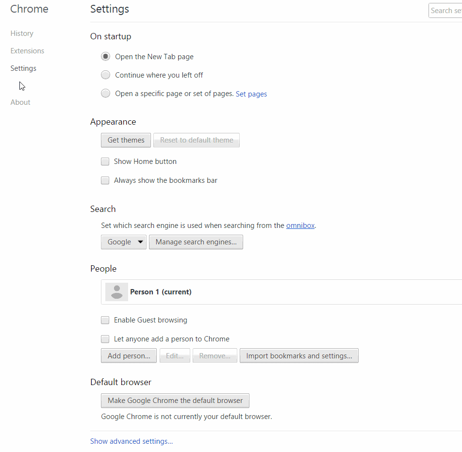

# كيف تحمي متصفّحك؟
كروم Chrome. سفاري Safari. فايرفوكس Firefox. إكسبلورر Explorer.

أولاً، قومي باختبار مدى أمان متصفّحك الحالي مع [Panopticlick](https://panopticlick.eff.org/).

**أيضا**

## إعدادات خصوصيّة المتصفح - نوافذ التصفّح السريّة.

## Browser Privacy Settings - Do Not Track and Private Browsing Windows

## DO NOT TRACK

**Chrome** &gt; Settings &gt; Show Advanced Settings &gt; &gt; Privacy &gt; Send “Do Not Track” request with your browser traffic

**Firefox** &gt; Options &gt; Privacy &gt; manage your Do Not Track settings

**Safari** &gt; Menu &gt; Preferences &gt; Privacy &gt; Website tracking &gt; Ask websites not to track me

**Explorer** &gt; Tools \(Alt + X\) &gt; Safety &gt; Turn on tracking protection &gt; Enable

**Alternative Browsers and Search Engines**

### متصفّحات ومحركات بحث بديلة
* [Brave](https://www.brave.com/) عبارة عن متصفّح يقوم تلقائيًا بحظر أي إعلانات أو محاولات اختراق.
* [Tor](https://www.torproject.org/) تطبيق تصفّح يتيح لك تصفّح الإنترنت بسريّة - من غير الكشف عن هويتك الشخصية.
* [DuckDuckGo](https://duckduckgo.com/about) محرّك بحث سرّي لا يقوم بتتبّع مستخدميه.
* [StartPage](https://www.startpage.com/) محرّك بحث سرّي لا يقوم بتسجيل عنوان الـ IP الخاص بك ولا ما قمت بالبحث عنه.

**Incognito Mode**
## وضع التخفّي

* وضع التخفّي يقوم بمنع متصفّح كروم من تسجيل وحفظ بيانات ما قمت بزيارته أو تحميله.
* اختاري تخصيص أو تحكم كروم > نافذة تخفّي جديدة.
* أو قومي بالضغط على: Ctrl + Shift + N.

**New Private Window - Firefox**
## نافذة سريّة جديدة (فايرفوكس Firefox)
* نافذة سريّة جديدة تقوم بفتح نافذة تصفح سريّة في فايرفوكس.
* اختاري القائمة > نافذة سريّة جديدة.
* أو قومي بالضغط على: Ctrl + Shift + P.

**New Private Window - Safari**
## نافذة سريّة جديدة (سفاري Safari)

* نافذة سريّة جديدة تقوم بمنع سفاري من تتبّع أي صفحات تقوم بالاطّلاع عليها.
* اختاري القائمة > نافذة سريّة جديدة
* أو قومي بالضغط على: Command + Shift + N.

**InPrivate**

* InPrivate تقوم بمنع متصفح إنترنت إكسبلورر Internet Explorer من حفظ أي بيانات تتعلّق بجلسات تصفحك
* أدوات > الأمان >تصفّح  InPrivate.
* أو قومي بالضغط على: Ctrl + Shift + P.

### **Use a VPN**
## استخدمي الشبكة الظاهريّة الخاصة (VPN)

* الشبكة الظاهرية الخاصّة (VPN) هي أداة تقوم بإخفاء معرّفك الرقمي (IP) وتشفير كل ما البيانات المتدفقة  الخاصة بك على الإنترنت بحيث لا يستطيع أي شخص آخر الاطّلاع على ما تقوم بتصفحه على الانترنت..
*  مجاني: VPN:[OkayFreedom](http://www.okfreedom.com/) \ TunnelBear: https://www.tunnelbear.com

## **Tor**

متصفّح تور Tor صُمّم خصيصًا ليساعدك على الحفاظ على شخصيتك مجهولة، وهو متصفّح بسيط لكنه فعّال للغاية في تصفّح الإنترنت دون الكشف عن هويتك لأي شخص. للتحميل اضغطي هنا. 

Download it[ here](https://www.torproject.org/projects/torbrowser.html).

 ## Browser Extensions
## إضافات المتصفّح

إضافات المتصفّح (البرامج المساعدة/ الملحقات) هي عبارة عن برامج تقوم بتوسيع أو تخصيص عمل المتصفح. يمكن استخدام هذه الإضافات لحماية خصوصيّتك عن طريق حظر كل طرف ثالث (بين المستخدم وموفّر الخدمة) من تتبّع نشاطك الإلكتروني. تحذير: ثمة إضافات يمكن أن تكون إضافات خبيثة وغير آمنة (أمثلة).
[Examples](http://www.makeuseof.com/tag/x-malicious-browser-extensions-help-hackers-target-victims/).

### Recommended extensions:
## إضافات يُنصح بها:

* [HTTPS Everywhere](https://www.eff.org/https-everywhere) \(Hypertext Transfer Protocol with Secure Sockets Layer\)
(بروتوكول نقل النصوص التشعبيّة مع طبقة المنافذ الآمنة) - يؤمّن ويشفّر تدفق المعلومات التي تقومين بتصفّحها.

* [Privacy Badger](https://www.eff.org/privacybadger)  يقوم بحظر تتبّع ملفات تعريف الارتباط.  [cookies](https://en.wikipedia.org/wiki/HTTP_cookie)
* [uBlock Origin](https://www.ublock.org/)  عبارة عن حاجب  إعلانات.

# Erasing your browsing history
## حذف تاريخ التصفّح.

* كروم Chrome > سجل المحفوظات > حذف بيانات التصفّح.
* فايرفوكس Firefox > خيارات > الخصوصيّة >  سجل المحفوظات.
* منظفّات حواسب آليّة  يُنصح بها:

* [CCleaner](http://www.piriform.com/ccleaner)

* [BleachBit](http://www.bleachbit.org/)

---
