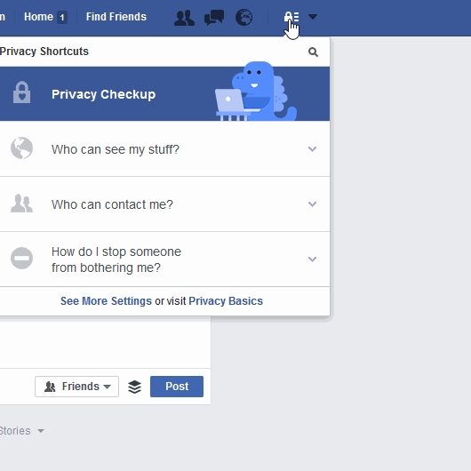

# إعدادات خصوصيّة التواصل الاجتماعي.

## Facebook فيسبوك

### من يستطيع رؤية منشوراتي؟

### من يستطيع مراسلتي؟

### كيف أقوم بإيقاف شخصًا ما من إزعاجي؟

## Twitter تويتر

### الأمان والخصوصيّة

## Devices الأجهزة

تعطيل نظام تحديد المواقع

| كيف تقومين بتأمين هاتفك الأندرويد؟ | كيف تقومين بتأمين هاتفك الآيفون؟ |
| --- | --- |
| قومي بإيقاف تشغيل الاتصال اللاسلكي ونظام تحديد المواقع (من خلال خدمات الموقع) وبيانات الهاتف (يمكن إيجاد ذلك في الإعدادات > الشخصيّة > الموقع). تنويه: قومي بتشغيل إعدادات الموقع حينما تكونين بحاجة لها فقط. من المهم الحفاظ على هذه الخدمة معطّلة حيث أنها تقوم بتقليل خطر تتبّع الموقع تحافظ على طاقة البطارية وتقلّل من نقل البيانات غير المرغوب فيها عبر التطبيقات التي تعمل في الخلفيّة أو مزوّد خدمة الهاتف عن الطريق التحكم عن بعد. (عن https://securityinabox.org/en/guide/basic-setup/android)
قومي بالاطّلاع على [كيفيّة إيقاف خدمة تحديد المواقع من خلال الإعدادات](http://www.wikihow.com/Turn-Off-Location-Services-on-an-Android). | 
قومي بإيقاف تشغيل الاتصال اللاسلكي ونظام تحديد المواقع: الإعدادات > الخصوصيّة > خدمات الموقع وإما أن تقومي بإيقاف كل خدمات الموقع عن طريق شريط التمرير الرئيسي أو اختيار أشرطة التمرير لكل الخدمات أو التطبيقات المختلفة على هاتفك. لإيقاف تشغيل كل خدمات الموقع لكل المواقع قومي بإيقاف خدمات الموقع لتطبيق سفاري على هاتفك. قومي بالاطّلاع على [كيفية إيقاف خدمات الموقع على iOS](http://www.tomsguide.com/us/turn-off-location-services-iphone,news-21276.html). |

## Messaging Apps
## تطبيقات المراسلة

### Whatsapp واتساب

[رسائل](https://www.whatsapp.com/) واتساب عبارة عن رسائل مشفّرة (بما معناه أن لا أحد يستطيع الاطّلاع على محتوى هذه الرسائل إلا المرسل والمستقبل) لكن البيانات الوصفيّة المتعلقة بمن تتحدثين معهم ومدة المحادثة يتم تخزينها وحفظها.

### Signal سيجنال

سيجنال عبارة عن تطبيق مراسلة لحظيّة ومكالمات صوتيّة مجانيّ لأندرويد، iOS والأجهزة المكتبية. يستخدم التطبيق تشفير النهاية-للنهاية لتأمين كل الاتصّالات مع مستخدمي سيجنال الآخرين. يمكن استخدام سيجنال لإرسال رسائل لحظيّة مشفّرة، رسائل جماعيّة، مرفقات ورسائل وسائط متعددة.

[نصائح أمنيّة يجب أن يعرفها كل مستخدم لسيجنال.](https://theintercept.com/2016/07/02/security-tips-every-signal-user-should-know/)

# نصيحة إضافيّة

* هام: قومي بإجراء [اختبار الخصوصيّة](http://smartprivacy.tumblr.com/privacynow)  بواسطة Smart Privacy. 

* قومي بإنشاء[ تنبيه على جوجل](https://www.google.com/alerts) باسمك الشخصيّ.

---

