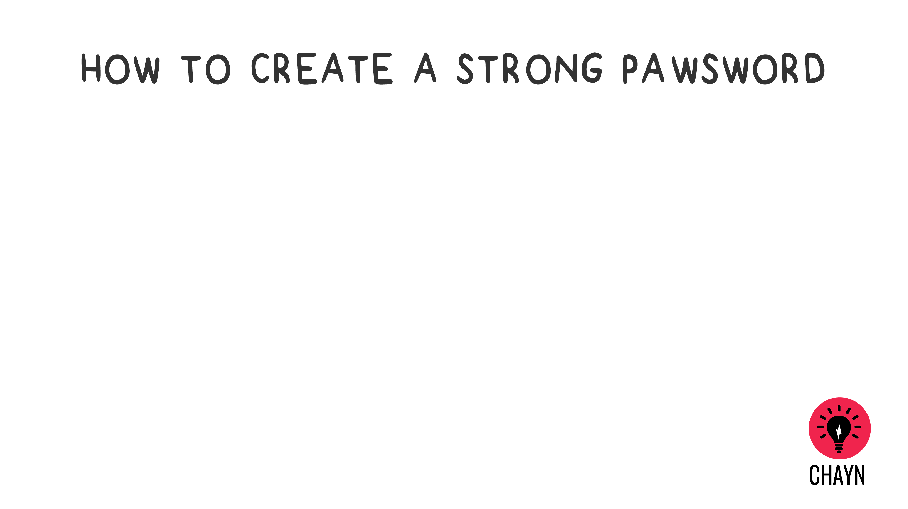

# How to set a killer pawsword \(sorry..we couldn’t help it\)
Easy steps to fight the most common vulnerability

### 1. Password protection

* Visit [How Secure Is My Password](https://howsecureismypassword.net/) to test the strength of your passwords

* Never recycle\/reuse passwords

* Do not use the same password across multiple sites - Create a new\/different password for every site you sign up to

* Do not let your browser save your passwords

* Think passphrase instead of password

* Use upper\/lower case letters, numbers, symbols - See [Strong Password Generator](https://strongpasswordgenerator.com/). Password Managers usually have a built-in password generator to create complex passwords

### 2. Use a password manager

Password Management software stores encrypted versions of your passwords so you can use a unique, secure password for every service without having to remember every password. There are plenty of[ free Password Managers](http://thehackernews.com/2016/07/best-password-manager.html) to select from, for example,[ KeePass](http://keepass.info/) \(see[ how to setup and use it](https://youtu.be/KQuDrKSZkck), [LastPass](https://www.lastpass.com/) and [Padlock](https://padlock.io/).

### 3. How should you change your password?

There have been debates about how often we should be changing our passwords. It is also recommended that we change your passwords every 3 – 9 months. We recommend that you change your passwords as often as you need in order to feel secure.

### 4. Two-Factor Authentication \(2FA\)

Two-Factor Authentication \(2FA\) makes it harder for anyone attempting to hack your accounts. Instead of signing into your accounts using one step \(your password\), you enter a second piece of data, a short code sent to you in an email, or text, or generated by an app on your phone. See which sites allow you to enable two-factor authentication [here](http://twofactorauth.org/).

---
 DIY Online Security by <a xmlns:cc="http://creativecommons.org/ns#" href="http://chayn.co" property="cc:attributionName" rel="cc:attributionURL">CHAYN</a> is licensed under a <a rel="license" href="http://creativecommons.org/licenses/by-sa/4.0/">Creative Commons Attribution-ShareAlike 4.0 International License</a>.