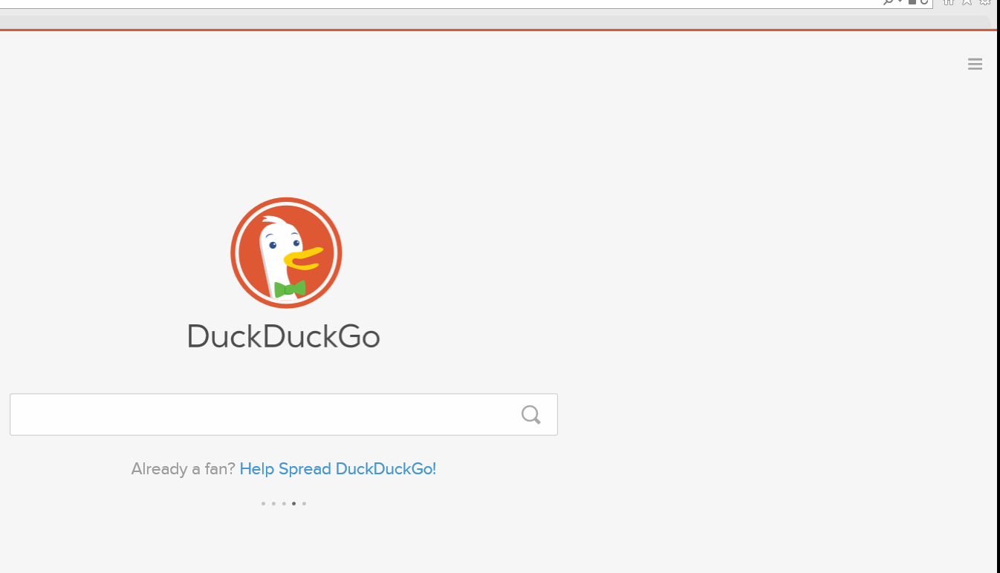

# How to pawtect\(fine.. protect\) your browser

### Chrome. Safari. Firefox. Explorer.

First, test how safe your current browser is with [Panopticlick](https://panopticlick.eff.org)

Browser Privacy Settings - Do Not Track and Private Browsing Windows

## DO NOT TRACK

**Chrome** &gt; Settings &gt; Show Advanced Settings &gt; &gt; Privacy &gt; Send “Do Not Track” request with your browser traffic

**Firefox** &gt; Options &gt; Privacy &gt; manage your Do Not Track settings

**Safari** &gt; Menu &gt; Preferences &gt; Privacy &gt; Website tracking &gt; Ask websites not to track me

**Explorer** &gt; Tools \(Alt + X\) &gt; Safety &gt; Turn on tracking protection &gt; Enable

**Alternative Browsers and Search Engines**

* [Brave](https://www.brave.com/) is a browser which automatically blocks ads and trackers
* [Tor](https://www.torproject.org/) is a browsing software that enables you to surf the web anonymously
* [DuckDuckGo](https://duckduckgo.com/about) is a private search engine that does not track its users
* [StartPage](https://www.startpage.com) is a private search engine that does not record your IP address or
* track your searches

**Incognito Mode**

* Incognito mode on the web prevents Google Chrome from saving a record of
* what you visit and download.
* Customise and control Google Chrome &gt; New incognito window
* Or hold down: Ctrl + Shift + N

**New Private Window \(Firefox\)**

* New Private Window opens a private browsing window in Firefox.
* Open menu &gt; New Private Window
* Or hold down: Ctrl + Shift + P

**New Private Window \(Safari\)**

* New Private Window stops Safari from keeping track of what web pages you're viewing.
* File menu &gt; New Private Window
* Or hold down: Command + Shift + N

**InPrivate**

* InPrivate helps prevent Internet Explorer from storing data about your browsing session.
* Tools &gt; Safety &gt; InPrivate Browsing
* Or hold down: Ctrl + Shift + P

### **Use a VPN**

* A VPN, or a Virtual Private Network, is a way of disguising your IP and encrypting all of your internet traffic so that no one can find out what you’re viewing online.
* Free VPN:[OkayFreedom](http://www.okfreedom.com/en/) \(please note: the free version of OkayFreedom is[ad-supported](http://www.okfreedom.com/en/)\)[TunnelBear](https://www.tunnelbear.com/)

## **Tor**

The Tor Browser is designed to help keep you anonymous and is a simple yet effective way of browsing the internet without revealing your identity to anyone.

Download it[ here](https://www.torproject.org/projects/torbrowser.html).

 ## Browser Extensions

Browser extensions \(Add-ons\/plug ins\), are programs which extend or customise a web browser. Extensions can be used to protect your privacy by blocking third parties from tracking your online activity. WARNING: Extensions can also be malicious \[examples](http://www.makeuseof.com/tag/x-malicious-browser-extensions-help-hackers-target-victims).

### Recommended extensions:

* [HTTPS Everywhere](https://www.eff.org/https-everywhere) \(Hypertext Transfer Protocol with Secure Sockets Layer\)
* secures and encrypts your internet traffic
* [Privacy Badger](https://www.eff.org/privacybadger) blocks tracking [cookies](https://en.wikipedia.org/wiki/HTTP_cookie)
* [uBlock Origin](https://www.ublock.org) is an adblocker

# Erasing your browsing history

* Chrome &gt; History &gt; Clear browsing data
* Firefox &gt; Options &gt; Privacy &gt; History
* Recommended PC Cleaners:

* [CCleaner](http://www.piriform.com/ccleaner)

* [BleachBit](http://www.bleachbit.org)

---
 DIY Online Security by <a xmlns:cc="http://creativecommons.org/ns#" href="http://chayn.co" property="cc:attributionName" rel="cc:attributionURL">CHAYN</a> is licensed under a <a rel="license" href="http://creativecommons.org/licenses/by-sa/4.0/">Creative Commons Attribution-ShareAlike 4.0 International License</a>.

