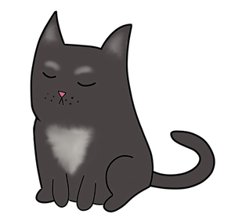

# Hazlo Tu Misma Seguridad En Línea

Deja que el GATO CODIFICADOR DE CHAYN te muestre cómo alguien te puede estar siguiendo el rastro y qué puedes hacer al respecto 

Estás leyendo la guía BÁSICA. También tenemos una guía avanzada que puedes leer aquí: https://chayn.gitbooks.io/advanced-diy-privacy-for-every-woman/content/

“No importaba lo que hiciera – él siempre me encontraba. Ahora sé cómo hacía para lograrlo…”

“Vaya, esto realmente te abre los ojos!” 

“Esta es la primera vez que alguien ha podido brindar mayor claridad sobre este tema – generalmente las autoridades parecieran no tener ni idea…”

# ¿PARA QUIÉN ES ESTA GUÍA?

Para todos, en cualquier lugar. Aunque fue escrita pensando en  las mujeres que están lidiando con violencia doméstica o acoso, esta guía y sus principios pueden ser usados por cualquier persona independientemente de su género, ubicación o situación.

¿Alguien tiene fotos tuyas y tú no sabes cómo ni por qué? ¿Esa persona se aparece constante e inesperadamente en los sitios donde estás? ¿Sabe cosas sobre tu vida que no le has contado a muchas personas? Entonces, te podrían estar acosando.

# ¿DE QUÉ SE TRATA ESTA GUÍA?

El uso de tecnología como la internet, los teléfonos móviles, etc., hacen que cada vez sea más fácil para las parejas abusadoras acosar, intimidar y amenazar a sus víctimas tanto virtual como físicamente. La buena noticia es que tú puedes tomar precauciones para protegerte!

Mide los riesgos a los que estás expuesta y toma nuevamente el control con esta guía que contiene las mejores prácticas.

# CÓMO USAR ESTA GUÍA

Hay muchas maneras en que alguien puede localizarte. La facilidad y la probabilidad de que esto suceda, dependen en gran medida de tus circunstancias personales y las de tu agresor. Esta guía no es la respuesta absoluta. La guía no incluye todas las formas en que los agresores pueden seguirle el rastro a alguien, pero es un apoyo que recopila los mejores consejos que hemos encontrado. ¡Aquí vamos!

 
 
---

