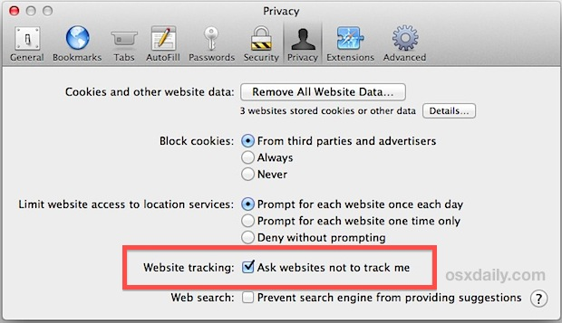

# Cómo proteger tu navegador

### Chrome. Safari. Firefox. Explorer.

Primero, prueba qué tan seguro es tu actual navegador con [Panopticlick](https://panopticlick.eff.org/)

**y esto:**

## Configuración de Privacidad del Navegador - No Seguimiento y Ventanas Privadas de Navegación

## NO SEGUIMIENTO

**Chrome** > Configuración > Mostrar Configuración Avanzada > > Privacidad > Enviar solicitud de “No Seguimiento” con tu tráfico de navegación

**Firefox** > Opciones > Privacidad> Administrar tu configuración de “No Seguimiento”

**Safari** > Menú > Preferencias > Privacidad > Seguimiento de sitios web > Pedir a los sitios web no seguirme

**Internet Explorer** > Herramientas (Alt + X) > Seguridad >Activar la protección de rastreo > Habilitar

**Navegadores y Motores de Búsqueda Alternativos**

* [Brave](https://www.brave.com/) is a browser which automatically blocks ads and trackers
* [Tor](https://www.torproject.org/) is a browsing software that enables you to surf the web anonymously
* [DuckDuckGo](https://duckduckgo.com/about) is a private search engine that does not track its users
* [StartPage](https://www.startpage.com/) is a private search engine that does not record your IP address or track your searches

**Modo Incógnito**
* El Modo Incógnito en la web evita que Google Chrome guarde un registro de tus visitas o descargas. 
* Personaliza y controla  Google Chrome > Nueva ventana de incógnito 
* O mantén oprimido:  Ctrl + Mayús  + N

**Nueva Ventana Privada \(Firefox\)**

* Nueva Ventana Privada abre una ventana de navegación privada en Firefox. 
* Abrir menú  > Nueva Ventana Privada
* O mantén oprimido:  Ctrl + Mayús + P

**Nueva Ventana Privada \(Safari\)**

* Nueva Ventana Privada hace que Safari deje de rastrear qué páginas web estás viendo.
* Menú archivo > Nueva Ventana Privada
* O mantén oprimido: Comando + Mayús + N

**InPrivate**

* InPrivate ayuda a impedir que Internet Explorer almacene datos sobre tu sesión de navegación
* Herramientas > Seguridad > Exploración de InPrivate
* O mantén oprimido:  Ctrl + Mayús + P

### **Usa una VPN**

* Una VPN, o Red Privada Virtual, es una manera de ocultar tu dirección IP y cifrar todo tu tráfico en internet para que nadie pueda averiguar lo que estás viendo en línea. 
* [VPN gratuitas](http://www.okfreedom.com): OkayFreedom (por favor ten en cuenta: la versión gratuita de OkayFreedom es [financiada por publicidad](http://www.okfreedom.com/en/support#free)) [TunnelBear](https://www.tunnelbear.com/). Puedes encontrar extensiones de Chrome gratuitas/gratuitas premium [aquí](https://chrome.google.com/webstore/search/VPN?_category=extensions), y complementos de VPN para Firefox gratuitos/gratuitos premium en el menú Abrir > Complementos > Obtener complementos > escribe “VPN” en la barra de búsqueda.

## **Tor**

El navegador Tor está diseñado para ayudarte a mantenerte anónimo y es una simple pero efectiva manera de navegar en internet sin revelar tu identidad a nadie
Descárgalo [ here](https://www.torproject.org/projects/torbrowser.html).

 ## Extensiones para Navegadores

Las extensiones de los navegadores (complementos/programas adicionales), son  programas que extienden o personalizan un navegador de internet. Las extensiones pueden ser utilizadas para proteger tu privacidad al bloquear a terceros  para que no hagan seguimiento de tu actividad en línea. ADVERTENCIA: las extensiones también pueden ser maliciosas [ejemplos](http://www.makeuseof.com/tag/x-malicious-browser-extensions-help-hackers-target-victims).

### Extensiones recomendadas:

* [HTTPS Everywhere](https://www.eff.org/) \(Protocolo de Transferencia de hipertexto con  Secure Sockets Layer) asegura y codifica tu tráfico en internet\)
* [Privacy Badger](https://www.eff.org/privacybadger) bloquea el seguimiento de [cookies](https://en.wikipedia.org/wiki/HTTP_cookie)
* [uBlock Origin](https://www.ublock.org/) es un bloqueador de anuncios de publicidad

# Borrar tu historial de navegación

* Chrome &gt; History &gt; Borrar datos de navegación
* Firefox &gt; Options &gt; Privacidad > Historial
* Limpiadores recomendados para tu computador:

* [CCleaner](https://www.google.com/url?q=http://www.piriform.com/ccleaner&sa=D&ust=1478912695317000&usg=AFQjCNHmtswm2AwMsRtywjxd7unIPKSXSg)

* [BleachBit](https://www.google.com/url?q=http://www.bleachbit.org/&sa=D&ust=1478912695318000&usg=AFQjCNEjz3m2EuO6O2lPl4Vo_KAe6CHsjQ)

---

