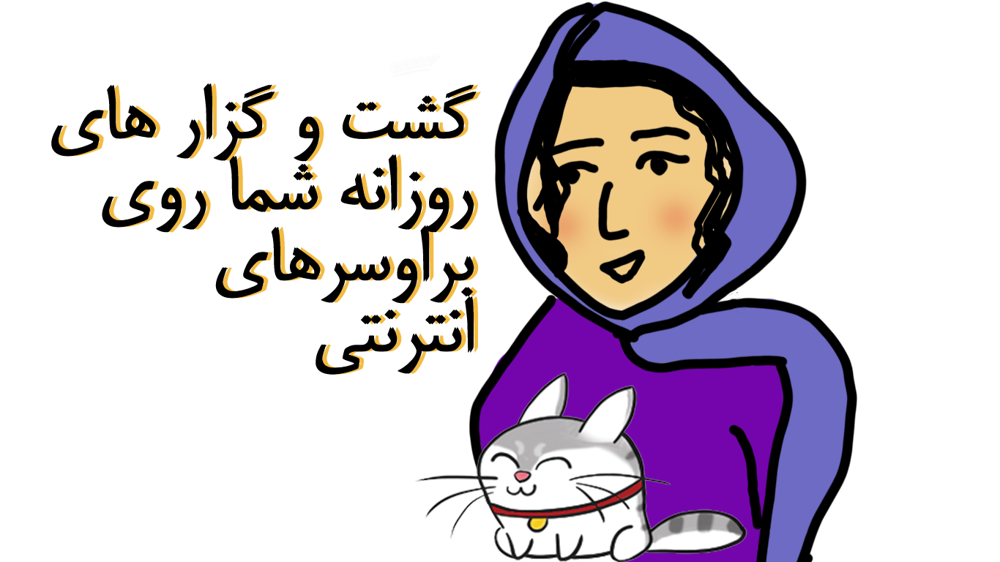

### بسته آموزشی مبتدی

شما در اینجا راهنمای مبتدی را خواهید خواند. برای راهنمایی های پیشرفته تر به اینجا مراجعه نمائید 
https://chayn.gitbooks.io/advanced-diy-privacy-for-every-woman/content/

 

    «مهم نیست چیکار کردم، او مرا پیدا کرد. حالا می دانم او چطور این کار را انجام داد.»

    «چه خوب، این واقعا آموزنده بود!»
    
    « این اولین بار است که کسی قادر است همه ی این ها را بداند - مسئولان امور معمولی و ناتوان به نظر می رسند.»

## این رهنمود برای چه کسانیست ؟
 برای همه کس در همه جا. هرچند این نوشته در مورد برخورد زنان با خشونت محلی و یا تعقیب و ایجاد مزاحمت برای آنهاست، اما این رهنمود و اصول آن برای همه است بدون در نظرداشت جنسیت، مکان و وضعیت. آیا کسی عکسهای شما را دارد و شما نمی دانید چگونه آنها را بدست آورده است؟ آیا آنها به هرجایی که شما می روید، به طور غیرمنتظره سر راه تان سبز می شوند؟ آیا آنها در مورد زندگی شما چیزهایی می دانند که شما فقط برای تعداد محدودی گفته اید؟ پس شاید شما مورد تعقیب قرار گرفته اید.

 
  
## این رهنمود در مورد چیست؟
تکنولوژی مدرن مثل اینترنت، موبایل و غیره به طور فزاینده ای رعب و تهدید کسی را برای شرکای سوءاستفاده گرا چه آنلاین و چه آفلاین آسان ساخته است. خبر خوب این است که شما می توانید خودتان را محفوظ نگه دارید. خطر را پیش بینی کنید و کنترل را با این رهنمود تجربی دوباره به دست آورید.

## چگونه از این رهنمود استفاده کنیم؟
روش های متعددیست که شخص شما را مورد تعقیب قرار دهد. فرصت و آسانی این حادثات شدیدا وابسته به شرایط شخصی شما و شخص سوء استفاده گر میباشد. این رهنمود پاسخ کاملی برای شما نخواهد بود و شامل تمامی راه های موجود برای اشخاصی که با ردیابی دیگران از آنان سوء استفاده میکنند نمیشود، اما این مجموعه دارای نکات و حمایاتی بشمول بهترین یافته های ماست. شروع میکنیم!!

