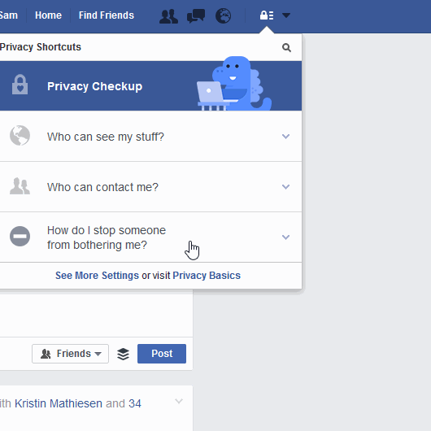

# تنظیمات حریم خصوصی رسانه های اجتماعی

## Facebook فیسبوک

### چه کسانی پست های مرا می بینند؟

### چی کسانی می توانند با من ارتباط برقرار نمایند؟

### چگونه از آزار و اذیت دیگران جلوگیری نمایم؟

## Twitter توییتر

### امنیت و حریم خصوصی

## تلفون های هوشمند

Disable Location موقعیت خودتان را غیرفعال نمایید

_**چگونه موبایل اندروید خود را امن بسازیم؟**_
بی سیم و موقعیت GPS خود را غیرفعال سازید (در Location Services رفته) سپس روی mobile data بروید (این را می توانید از Settings ، بعدا Personal و در آخر Location را بیابید و غیر فعال سازید.
یادداشت: فقط در صورت ضرورت Location خود را فعال سازید. این مهم است که قبل از قبل این خدمات غیرفعال باشد چون خطر تعقیب و ردیابی را کاهش می دهد، شارژ بطری تان را ذخیره می کند وفعالیت های داده های غیرضروری را در پس زمینۀ موبایل تان کاهش می دهد.
گرفته شده از: ( https://securityinabox.org/en/guide/basic-setup/android))
به این لینک سر بزنید: Turn Off Location Services through Settings

**چگونه موبایل آیفون خود را امن بسازیم؟: **
بی سیم و موقعیت GPS خود را غیرفعال سازید:
در Settings رفته، روی Privacy بروید، سپس Location Services رفته و آنرا غیر فعال سازید و یا همۀ خدمات موقعیت های تانرا غیر فعال سازید.

## رمزگزاری موبایل های تان
### اندروید
در Settings رفته بعدا روی Security بروید و سپس Encrypt device را فشار دهید.
احتمالا یک ساعت در بر گیرد تا موبایل تان رمزگزاری شود. به یاد داشته باشید که موبایل تان شارژ کافی داشته باشد. هر دفعه که موبایل را روشن می کنید، رمز موبایل را باید بزنید تا موبایل تان رمزگزاری شود.
 
### آیفون
 
ایفون قبل از قبل رمگزاری شده است. به یاد داشته باشید که برای اینکه به دشواری در دسترس قرار بگیرید از پاسکودهای طولانی استفاده نمایید.

## اپلکیشن های پیام رسانی

### وتس آپ Whatsapp

پیام های اپلکشن [وتس آپ](http://whatsapp.com) یک به شکل رمز می باشد (یعنی محتوای پیام های که شما می فرستید صرف توسط خودتان و گیریندۀ پیام تان دیده می شود) ولی فرا داده ها برای کسی که پیام می فرستید و چه مدت زمانی ذخیره می شود.

### سیگنال Signal

[Signal by Open Whisper Systems](https://whispersystems.org/) یک اپلبکشن رایگان و منبع باز رمزگزاری شده که با پشتبانی مکالمه صوتی و پیام رسانی فوری برای سیستم عامل اندروید، آی او اس و دسکتاپ می باشد. بعد از هر پیامی پیام تان رمگزاری می شود تا همۀ ماکملۀ تان را برای کاربران سیگنال محفوظ نگه دارد. سیگنال برای فرستادن و دریافت پیام های فوری، پیام های گروهی، ضمیمه و پیام های تصویری و ویدیویی رمزگزاری شده استفاده می شود.

End-to-end encryption: https://en.wikipedia.org/wiki/End-to-end_encryption

[Security Tips Every Signal User Should Know](https://theintercept.com/2016/07/02/security-tips-every-signal-user-should-know/)

[مزایای امنیتی که هر کاربر سیگنال باید بفهمد.](https://www.google.com/url?q=https://theintercept.com/2016/07/02/security-tips-every-signal-user-should-know/&sa=D&ust=1478912695344000&usg=AFQjCNEg5QaQwxEpg5CJqH049_FqKIAnYA)

# توصیه های بیشتر

* [مهم: امتحان حریم خصوصی را با Smart Privacy بدهید](http://smartprivacy.tumblr.com/privacynow)

*  برای اسم تان [Google Alert](https://www.google.com/alerts) بسازید. 