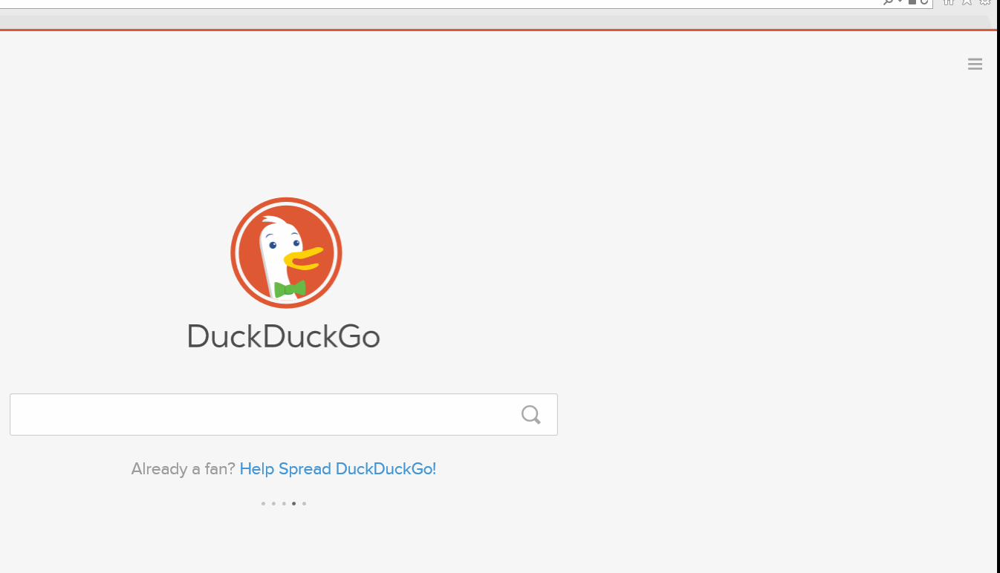

# Comment prrrrrotéger (ok.. Protéger ) ton navigateur

### Chrome. Safari. Firefox. Explorer.

En premier lieu, teste ton navigateur à l’aide de [Panopticlick](https://panopticlick.eff.org/) pour savoir s’il est vraiment sécurisé. 

Paramètres de confidentialité de ton navigateur - Interdire le suivi et Fenêtre de navigation privée

## INTERDIRE LE SUIVI

**Chrome** > Paramètres > Afficher les Paramètres Avancés > Confidentialité > Envoyer une demande “Interdire le suivi” pendant la navigation

**Firefox** > Options > Vie privée > Gérer les paramètres Ne pas me pister

**Safari** > Menu > Préférences > Confidentialité > Suivi de site web > Demander aux sites web de ne pas me suivre

**Explorer** > Outils (Alt + X) > Sécurité > Activer la protection contre le tracking > Activer

**Autres navigateurs et moteurs de recherche**

* Le navigateur [Brave](https://www.brave.com/) bloque automatiquement les publicités et les trackers
* Le logiciel de navigation [Tor](https://www.torproject.org) permet de consulter le web de manière anonyme
* [DuckDuckGo](https://duckduckgo.com/about) est un moteur de navigation privée qui ne piste pas ses utilisateurs
* Le moteur de navigation privée [StartPage](https://www.startpage.com/) n’enregistre jamais ton adresse IP, ni ne piste tes recherches

**Mode Navigation privée (Google Chrome)**

* Le Mode Navigation privée sur le web empêche  Google Chrome d’enregistrer l’historique des pages que tu visites ou de tes téléchargements
* Personnaliser et contrôler Google Chrome > Nouvelle fenêtre de navigation privée
* Ou appuie simultanément sur les touches : Ctrl + Maj + N

**Nouvelle fenêtre privée (Firefox)**

* Pour ouvrir une nouvelle fenêtre de navigation privée dans Firefox
* Ouvre le menu Firefox > Icône Fenêtre Privée
* Ou appuie simultanément sur les touches : Ctrl + Maj + P

**Nouvelle fenêtre de navigation privée (Safari)**

* New Private Window empêche Safari de conserver un historique des pages que tu visites
* Fichier > Nouvelle fenêtre privée
* Ou appuie simultanément sur les touches : Ctrl + Maj + N

**InPrivate (Internet Explorer)**

InPrivate empêche Internet Explorer de conserver des données sur ta navigation 
Outils > Sécurité > Navigation InPrivate
Ou appuie simultanément sur les touches : Ctrl + Maj + P

## Utilise un VPN

* Un VPN, de l’anglais Virtual Private Network ou réseau privé virtuel, est un moyen de masquer ton adresse IP et d’encrypter (chiffrer) ton trafic Internet de manière à ce que personne ne puisse voir ce que tu consultes en ligne 
* Nous te suggérons les VPN gratuits [OkayFreedom](http://www.okfreedom.com/en/) (remarque : la version privée d’OkayFreedom [contient de la publicité](http://www.okfreedom.com/en/support#free)) ou [TunnelBear](https://www.tunnelbear.com/). Tu trouveras des extensions VPN pour Chrome gratuites ou freemium [ici](https://chrome.google.com/webstore/search/VPN?_category=extensions), et des modules VPN pour Firefox en ouvrant le Menu Firefox > Modules > Catalogue > Découvrir davantage de modules > tape “VPN” dans la barre de recherche. Ou directement [ici](https://addons.mozilla.org/fr/firefox/).

## Tor

Le navigateur Tor est conçu pour t’aider à conserver ton anonymat. C’est un moyen simple et efficace de naviguer sur le web sans avoir à divulguer ton identité à qui que ce soit. Télécharge-le [ici](https://www.torproject.org/projects/torbrowser.html.en).

 ## Extensions pour navigateurs

Les extensions pour navigateurs (autrement appelés Add-ons, plug ins ou modules) sont des programmes qui étendent ou personnalisent les fonctionnalités de ton navigateur. Tu peux utiliser des extensions pour protéger ta vie privée et empêcher qui que ce soit de surveiller ou pister tes activités en ligne.  ATTENTION : il existe également des extensions malveillantes [des exemples ici](http://www.makeuseof.com/tag/x-malicious-browser-extensions-help-hackers-target-victims/).

### Nous recommandons les extensions suivantes:

* [HTTPS Everywhere](https://www.eff.org/https-everywhere) (protocole de transfert hypertexte sécurisé) protège et encrypte ton trafic internet
* [Privacy Badger](https://www.eff.org/privacybadger) bloque les [cookies](https://en.wikipedia.org/wiki/HTTP_cookie) de pistage, ou “trackers”
* [uBlock Origin](https://www.ublock.org/) est un bloqueur publicitaire

# Efface ton historique de navigation
* Chrome > Historique > Effacer les données de navigation 
* Firefox > Ouvrir le menu > Historique > Effacer l’historique récent
* Nous recommandons les utilitaires de nettoyage suivants:
* [CCleaner](http://www.piriform.com/ccleaner)
* [BleachBit](http://www.bleachbit.org/)

---

