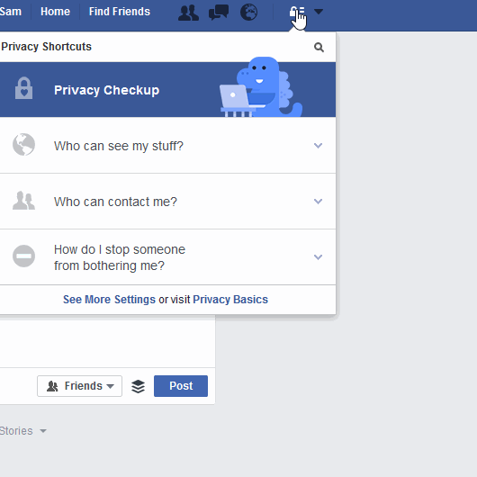
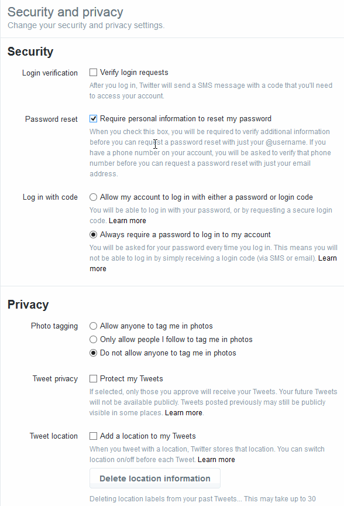

# Options de sécurité pour les réseaux sociaux

## Facebook

### Qui peut voir mon contenu ?

### Qui peut me contacter ?

### Comment empêcher quelqu’un de me contacter ?

## Twitter

### Sécurité et confidentialité

## Appareils

### Désactiver la géolocalisation

**Sécuriser un téléphone Android: ** Désactive la géolocalisation via satellites GPS et réseaux sans fil (dans Services de localisation) et le transfert de fichiers/données (dans Gestionnaire de données -> Réception des données).

Active les paramètres de localisation dans la mesure de tes besoins. Il est important de veiller à ce que ces services ne fonctionnent pas en arrière-plan par défaut et de réduire ainsi les risques d'être localisé, économiser la batterie et réduire les flux de données indésirables initiés par des applications en arrière-plan ou par ton opérateur de téléphonie mobile à distance . 

(Source, légèrement adaptée : https://securityinabox.org/fr/android_basic#1.4)

Il est possible que tes paramètres et réglages apparaissent un peu différemment sur ton appareil Android. Auquel cas, essaie la manoeuvre suivante:

Réglages > Localisation > Désactiver.

Ainsi que:

Réglages > Utilisation des données > Trafic de données mobiles > Désactiver.

Voir aussi la page suivante: http://fr.wikihow.com/d%C3%A9sactiver-le-GPS-sur-un-dispositif-Android

**Sécuriser un iPhone:**
Désactiver le Wifi et la localisation GPS:

Paramètres > http://fr.wikihow.com/d%C3%A9sactiver-le-GPS-sur-un-iPhone & http://fr.wikihow.com/activer-les-services-de-localisation-sur-iOS

## Encrypte tes appareils

### Android

Paramètres > Sécurité > Cryptez l'appareil

Le processus prendra environ une heure, fais donc attention à ce que ta batterie soit chargée. Il te faudra entrer un mot de passe pour décrypter ton téléphone à chaque fois que tu le remettras en marche. 

### iPhone

Tous les iPhones sont encryptés par défaut. Sois tout de même vigilante et utilise un mot de passe long, qui le rendra plus difficile d’accès. 

# Applis de messagerie

## Whatsapp
[WhatsApp](https://www.whatsapp.com/) chiffre tous les messages, ce qui veut dire que seuls toi et ton destinataire sont à même de lire les messages échangés. Cependant, des métadonnées au sujet des personnes avec lesquelles tu converses sur Whatsapp, et la durée de vos conversations, sont collectées et archivées. 

## Signal
[Signal, développé par Open Whisper Systems](https://whispersystems.org/), est une appli gratuite et ouverte, cryptée, qui permet d’envoyer des messages instantanés et de passer des appels. Elle est disponible pour Android,  iOS et PC. Elle utilise le [chiffrement de bout](https://fr.wikipedia.org/wiki/Chiffrement_de_bout_en_bout) en bout pour sécuriser les communications entre ses utilisateurs.  Signal peut également être utilisée pour envoyer et recevoir des messages en groupe, des pièces jointes et des messages multimédia. 

[**Security Tips Every Signal User Should Know
** ](https://whispersystems.org/blog/signal-desktop/)

# Conseils supplémentaires

o  IMPORTANT : Fais le [Test de confidentialité de Smart Privacy](http://smartprivacy.tumblr.com/privacynow)
o  Met en place une  [Alerte Google](https://www.google.com/alerts) pour ton nom

---

