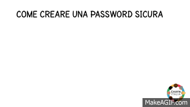

# Come creare una password blindatissima

Cinque passaggi per combattere una delle cause principali della vulnerabilità online

Ecco alcune facili mosse per combattere le cause più comuni della vulnerabilità online

## 1. Proteggi la tua password

*  Vai [su questo sito](https://password.kaspersky.com/it/?utm_medium=rdr&utm_source=redirector&utm_campaign=old_url&utm_medium=smm&utm_source=fb_p_160118&utm_campaign=it_ai_target) e fai il test per vedere quanto è sicura la tua password
* Non usare mai una password che hai già usato in passato
* Non usare la stessa password per più siti, ma creane ogni volta una diversa
* Non permettere al tuo browser di salvare le tue password \(o al tuo computer nel Portachiavi\)
* Quando crei una password, usa una frase invece che una o più parole staccate
* Usa lettere maiuscole e minuscole, numeri e simboli. Se vuoi una password che sia sicura, puoi crearne una [su questo sito](https://identitysafe.norton.com/it/password-generator)

## 2. Usa un password manager

Un password manager — o gestore di password — è un software che memorizza tutte le versioni criptate \(cioè che solo tu conosci e nessun altro, nemmeno il software\) delle tue password. In questo modo puoi usare delle password complicate e sempre diverse per ogni sito o account senza dovertele ricordare, perché il password manager le ricorda e inserisce di volta in volta al posto tuo. Fondamentalmente funziona come l’applicazione ‘portachiavi’ del tuo computer, ma è sicuro perché salva solo le versioni criptate delle tue password. Ci sono vari software di password manager che puoi scaricare gratuitamente, come

- [KeePass](http://keepass.info/) [\(qui come installarlo\)](https://youtu.be/Jf9uV9L9DPg)

- [LastPass](https://www.lastpass.com/) [\(qui come installarlo\)](https://youtu.be/Ml8QriHsPZI)

- [Padlock](https://padlock.io/)

## 3. Quanto spesso si deve cambiare password?

È una questione dibattuta. Di solito si raccomanda di cambiare password ogni 3-9 mesi, ma noi ti consigliamo di cambiarla anche più spesso se la cosa ti fa sentire più sicura.

## 4. Autenticazione a due fattori \(2FA\)

L’autenticazione a due fattori — Two-Factor Authentication in inglese — fa sì che sia più difficile hackerare il tuo account. Invece di loggarti nei tuoi account attraverso un solo passaggio — per esempio inserendo la tua password — puoi fare sì che sia necessario inserire anche un altro tipo di informazione oltre la password, per esempio un codice che ti viene inviato di volta in volta per email o per messaggio, oppure che viene generato da un’applicazione sul tuo telefono. Facebook, Google+, LinkedIn, Medium, Snapchat, Tumblr, Twitter e Wordpress permettono l’autenticazione a due fattori. Instagram, Meetup, Pinterest, invece non lo permettono. Per un elenco dei siti che ti permettono o meno di loggarti tramite l’autenticazione a due fattori, leggi [qui](https://twofactorauth.org/).

