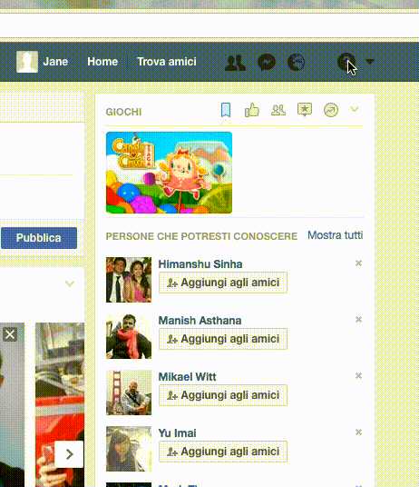
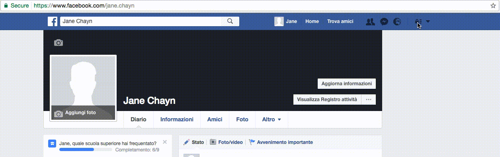
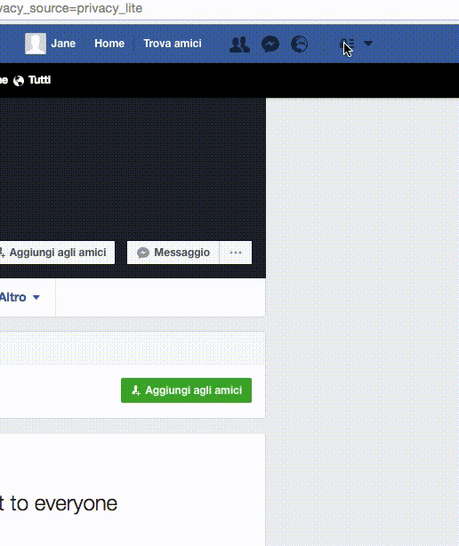
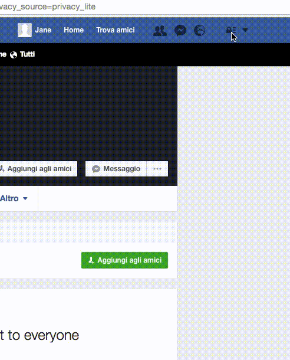

# **Social media e apparecchi elettronici**

## **Facebook**

### **Chi può vedere i miei post?**

### 

### **Chi mi può contattare?**

### 

### **Come faccio a bloccare qualcuno che mi importuna?**

### 

### Attenzione: ci potrebbero essere più foto di te su Facebook di quello che immagini

Per controllare quali foto di te sono su Facebook, scrivi nella barra di ricerca in alto a sinistra "Foto + il tuo nome su Facebook" e ti apparirà l'elenco di tutte le foto.

**Ma purtroppo non è tutto**: ce ne potrebbero essere altre che appaiono solo quando imposti come lingua English \(US\). Per esempio, tutte le fotografie per cui non hai accettato il tag, e che quindi non appaiono sulla tua bacheca, rimangono lo stesso connesse a te finché non cancelli il tag o riporti la foto.

Ecco come fare per rimediare:

– Clicca sulla freccina a destra della barra blu in alto e quando ti si apre il menù a tendina clicca **Impostazioni**

– Dalla colonna che ti appare a sinistra della pagina clicca **Lingua**

– Nella riga **Che lingua vuoi usare su Facebook?** clicca sopra la lingua che attualmente hai impostato e, dal menù a tendina, scegli **English \(US\)**

– Clicca su **Salva modifiche**

– A questo punto fai di nuovo la ricerca delle tue foto. Nella barra di ricerca in alto a destra scrivi "Photos + il tuo nome su Facebook"

– Se vedi delle foto che non desideri siano connesse a te puoi o cancellare il tag \(le foto rimangono su Facebook, ma non verranno trovate quando qualcuno cerca il tuo nome\), oppure riportarle a Facebook come inappropriate per farle eliminare.

– Clicca sulla foto, sposta il cursore sopra la foto e in basso ti appariranno varie opzioni. Clicca su **Options**, poi clicca su **Remove tag**. Se vuoi anche segnalare la foto a Facebook, seleziona anche **I also want to report this post**. Poi clicca su **OK**.

– Ripeti la procedura per ciascuna foto di cui vuoi eliminare il tag o che vuoi segnalare a Facebook.

– Quando hai finito, puoi tornare su **Impostazioni** \(che ora si chiamerà **Options**\) e rimettere la lingua che preferisci.

## **Twitter**

### **Sicurezza & Privacy**

## Dispositivi** elettronici: disabilita la geo-localizzazione**

#### **Come mettere in sicurezza un telefono Android:**

• disattiva la Wi-Fi \(Impostazioni &gt; Wi-Fi &gt; disattiva\)

• disattiva il GPS \(Impostazioni &gt; Personali &gt; Accesso alla posizione &gt; Disattiva\)

• disattiva la Connessione dati \(Impostazioni &gt; Reti mobili &gt; Connessioni dati &gt; disattiva\)

Ricorda: attiva questi servizi di geo-localizzazione solo quando ti servono. È importante che di norma rimangano spenti, perché questo riduce molto sia il rischio che venga rintracciata la tua posizione, sia il flusso di dati indesiderato trasmesso dalle applicazioni del tuo telefono o in remoto dal tuo operatore telefonico. In più, tenerli spenti ti fa durare la batteria molto più a lungo \(informazioni prese da [questo sito](https://securityinabox.org/en/guide/basic-security/android/)\).

[Leggi anche qui](http://it.wikihow.com/Disattivare-il-GPS-su-un-Dispositivo-Android) per maggiori informazioni su come disattivare il GPS.

#### **Come mettere in sicurezza un telefono iPhone:**

• disattiva la Wi-Fi \(Impostazioni &gt; Wi-Fi &gt; disattiva\)

• disattiva il GPS \(Impostazioni &gt; Privacy &gt; Localizzazione. A questo punto avrai una lista di applicazioni da poter scegliere fra cui Facebook e Trova il mio iPhone; per disattivare il tracciamento della posizione puoi selezionare le applicazioni che vuoi disabilitare o anche tutte. Se vuoi disattivare la localizzazione interamente spegni proprio l’impostazione Localizzazione invece che selezionare le applicazioni una per una.

## **Applicazioni di messaggistica**

**WhatsApp**: i messaggi sono criptati \(cioè il contenuto dei messaggi che mandi può essere visto solo da te e dalla persona che li riceve\), ma i metadati che riguardano con chi chatti e per quanto tempo sono raccolti e salvati dall’applicazione.

**Signal**: è un’applicazione di messaggistica libera e open-source che cripta le tue chiamate vocali e i messaggi per Android, iOS e Desktop. Utilizza la tecnologia end-to-end encryption che permette di mantenere al sicuro le comunicazioni con tutti gli altri utenti Signal. Signal può essere usato per mandare e ricevere messaggi istantanei, messaggi di gruppo, allegati, foto e audio tutti criptati. [Qui maggiori informazioni](http://www.informaticapertutti.com/signal-private-messenger-lapp-di-messaggistica-piu-sicura/) su come funziona Signal.

#### [Consigli di sicurezza che tutti dovrebbero seguire](https://theintercept.com/2016/07/02/security-tips-every-signal-user-should-know/)

### **Altri suggerimenti importanti**

• Importante: fai il [Test sulla privacy online](https://drive.google.com/open?id=1ncJSuYvbiTFA9bxaruaMXwupwPSljJ-iEq0C3ydGEi8)

• Crea un **Google Alert** per il tuo nome e/o il tuo indirizzo email. In questo modo verrai avvertita ogni volta che qualcuno metterà online il tuo nome o la tua email. [Qui le istruzioni per come fare](https://drive.google.com/open?id=1ncJSuYvbiTFA9bxaruaMXwupwPSljJ-iEq0C3ydGEi8).

