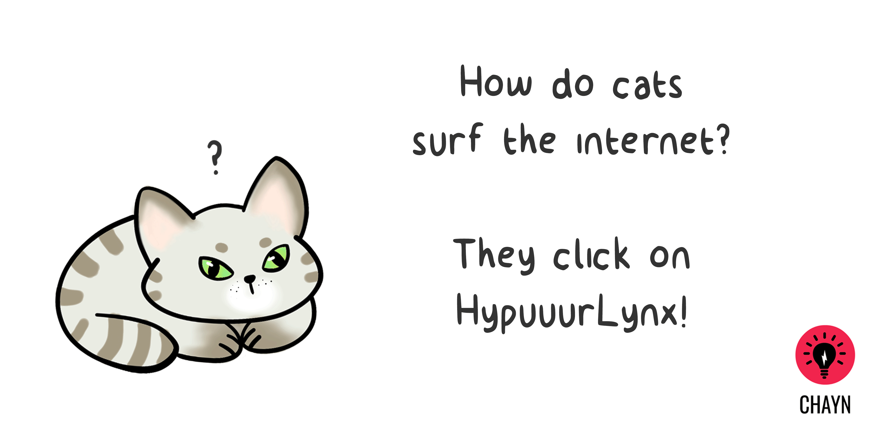
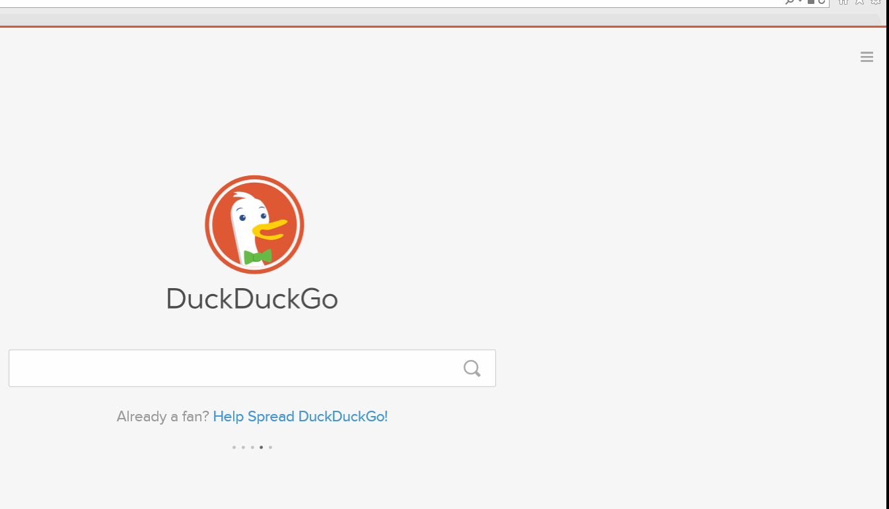

# څنګه کولای شئ خپل لټونګر(براوزر) وساتئ

کروم، سفاري، فایرفاکس، ایکسپلورر
لومړی د [Panopticlick](https://panopticlick.eff.org) په مرسته وګورئ چې ستاسو لټونګر (براوزر) څومره په امن کې دی.

**او دا:
**

## د لټونګر (براوزر) د محرمیت تنظیمات - نه تعقیبول او د خصوصي لټون کړکۍ یا وینډوز  

**Chrome** 
Chrome > Settings > Show Advanced Settings > > Privacy > Send “Do Not Track” request with your browser traffic

**Firefox** 
Firefox > Options > Privacy > manage your Do Not Track settings

 
* پنجرۀ شخصی جدید یک صفحۀ شخصی جدید را در براوسر فایرفاکس باز می کند.
* منیو را باز کنید بعدا گزینۀ New Private Window را انتخاب نمایید.
* و یا Ctrl + Shift + P را همزمان فشار بدهید.

**Safari** 
Safari > Menu > Preferences > Privacy > Website tracking > Ask websites not to track me

**Explorer** 

Explorer > Tools (Alt + X) > Safety > Turn on tracking protection > Enable

### نور لټونګر (براوزر) اود  لټون لارې

- [Brave](https://www.brave.com/) هغه لټونګر (براوزر) ده چې په اتومات ډول اعلانات او تعقیب کوونکي بندوي. 
- [Tor](https://www.torproject.org/) د لټون هغه سافټویر ده چې تاسو ته اجازه درکوي په مستعار ډول انټرنټ وکاروئ. 
- [DuckDuckGo](https://duckduckgo.com/about) هغه خصوصي  لټونګر ده چې خپل کاروونکي نه تعقیبوي. 
- [StartPage](https://www.startpage.com/) هغه خصوصي لټونګر ده چې ستاسو IP ادرس نه ثبتوي او نه ستاسو څارنې تعقیبوي. 

### Incognito حالت

- په انټرنټ کې Incognito حالت  ګوګل کروم نه پریږدي ترڅود هغه څه ریکارډ چې تاسو کتلی یا مو ډانلوډ کړی وي، ثبت کړي. 
- ګوګل کروم په خپله خوښه تنظیم او کڼټرول کړئ &gt; New incognito window 
-  یا د Ctrl + Shift + N کیکاږئ. 

### (نوي خصوصي کړکۍ یا وینډو (فایرفاکس 

- New Private Window یا نوي خصوصي کړکۍ په فایرفاکس کې تاسو ته یوه خصوصي لټونګره کړکۍ پرانیزي. 
- مینیو پرانیزئ وروسته New Private Window یا نوي خصوصي کړکۍ (وینډو) ته ولاړ شئ  
- او یا  Ctrl + Shift + P تڼۍ کیکاږئ. 

 (نوي خصوصي کړکۍ یا وینډو (سفاري

- New Private Window یا نوي خصوصي کړکۍ یا وینډو سفاري نه پریږدي چې هغه ویبپاڼې تعقیب کړي چې تاسو یې ګورئ. 
- فایل مینیو&gt; نوي خصوصي کړکۍ یا وینډو 
- او یا د Command + Shift + N تڼۍ کیکاږئ. 

### InPrivate

- InPrivate دې لپاره کارول کیږي ترڅو انټرنټ لټونګریا Internet Explorer نه پریږدي چې ستاسو لټول شوي معلومات ذخیره او وساتي. 
- Tools &gt; Safety &gt; InPrivate Browsing 
- او یا د Ctrl + Shift + P تڼۍ کیکاږئ. 

###  وکاروئVPN 

- VPN یا خصوصي مجازي شبکه  د  IP بدلولو او نورو ټولو انټرنټي معلوماتو کوډ ورکولو لپاره کارول کیږي ترڅو هیڅوک پوهه نه شي تاسو په انلاین توګه څه ګورئ. 
- وړیا خصوصي مجازي شبکه: [ OkayFreedom](http://www.okfreedom.com/en/) ( په یاد ولرئ چې: د [ OkayFreedom](http://www.okfreedom.com/en/) وړیا نسخه [ ad-supported](http://www.okfreedom.com/en/support#free) ده) [TunnelBear](https://www.tunnelbear.com/). کولای شئ د کروم خصوصي مجازي شبکې کومکي توکي[ دلته](https://chrome.google.com/webstore/search/VPN?_category=extensions) ومومئ، او د فایرفاکس خصوصي مجازي شبکې کومکي توکي  Opjen menu &gt; Add-ons &gt; Get add-ons وروسته  په لټون څانګه کې “VPN” ولیکئ. 

### Tor

تور لټونګر (براوزر) د دې لپاره ډیزاین شوی ترڅو تاسو وکولای شئ په مستعار ډول په انټرنټ کې کار وکړئ. تور د انټرنټ څخه د استفادې ساده او اغیزناکه لاره ده چې ستاسو اصلي پیژندګلوي هیچاته نه ښکاره کوي. 

[دلته](https://www.torproject.org/projects/torbrowser.html.en.) یې ډانلوډ کړئ.

### د لټونګر (براوزر) کومکي توکي

د لټونګر (براوزر) کومکي توکي (Add-ons/plug ins) هغه پروګرامونه دي چې په مرسته یې کولای شو ویب لټونګر (براوزر) په خپله خوښه تنظیم کړو. کومکي توکي (Extensions) د د ې لپاره کارول کیږي ترڅوستاسو د انلاین فعالیتونوحفاظت لپاره د دریمې ډلې لاسرسی بند کړي او مخه یې ونیسي. اخطاریه: کومکي توکي (Extensions) کیدای شي ځینې وختونه مضر واوسي.([مثالونه](http://www.makeuseof.com/tag/x-malicious-browser-extensions-help-hackers-target-victims/))

### وړاندیز کړای شوي کومکي توري یا (Extensions)

- [HTTPS Everywhere ](https://www.eff.org/https-everywhere) (Hypertext Transfer Protocol with Secure Sockets Layer) 
- ستاسو انټرنټي فعالیتونه ته امنیت بښي او هغوی ته کوډونه ورکوي. 
- [Privacy Badger](https://www.eff.org/privacybadger) ټولې تعقیب کوونکې کوکي ([cookies](https://en.wikipedia.org/wiki/HTTP_cookie)) بندوي ترڅو تاسو تعقیب نه شي کړای. 
- [uBlock Origin](https://www.ublock.org/) ټول اعلانونه بندوي او نه پریږدي ستاسو مخ ته راشي. 

### د لټونګر(براوزر) تاریخچه پاکول

- Chrome &gt; History &gt; Clear browsing data  
- Firefox &gt; Options &gt; Privacy &gt; History 
- وړاندیز کړای شوې کمپیوټر پاکوونکي:  
    - [CCleaner](http://www.piriform.com/ccleaner) 
    - [BleachBit](http://www.bleachbit.org/)

---
که چیرې تاسو په پاکستان کې ژوند کوئ او په انګلیسي /اردو ژبو خبرې کوئ، کولای شئ د ډیجیټل حقوقي بنسټونو انلاین ځورونې مرستندویه لاین سره د دوشنبې – جمعې ورځ د سهار ۹ بجو تر مازدیګر ۵ بجو پورې په لاندې ټیلفوني شمیره او بریښنالیک اړیکه ونیسئ.
ټیلفون شمیره: +92 0800-39393
بریښنالیک: helpdesk@digitalrightsfoundation.pk
