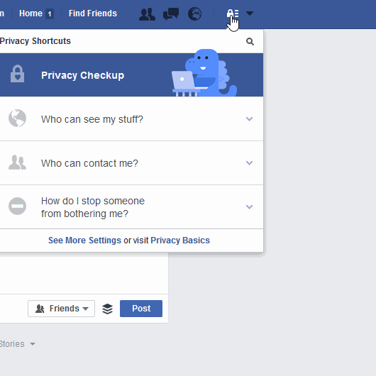
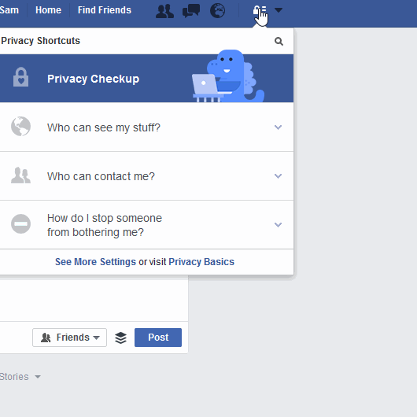
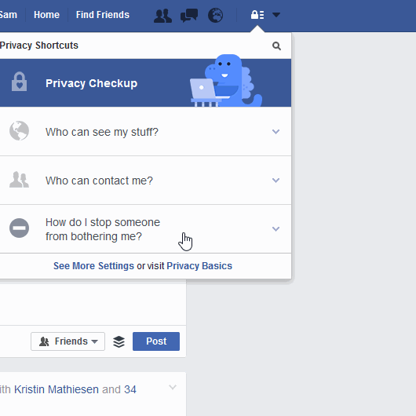

# د ټولنیزو رسینو محرمیت تنظیمات

## Facebook فیسبوک

### څوک له ما سره اړیکه نیولی شي؟

### څنګه کولای شم د هغه چا مخنیوي وکړم  چې مې ځوروي؟ 

### چگونه از آزار و اذیت دیگران جلوگیری نمایم؟

## Twitter توییتر

### امنیت او محرمیت

## الې یا توکي 
### د ځای غیرفعالول

**څنګه کولای شئ خپل انډرایډ محفوظ وساتئ:
**د بې سیمه او GPS (خدمتونو لاندې ځایونه) او د موبایل انټرنټ (چې د تنظیمات> شخصي> ځای له لارې کیږي) بند کړئ.
 
یاددښت: هغه وخت کې د ځای تنظیمات روښانه کړئ چې ورته اړتیا لرئ. که چیرې دا خدمتونه په اتومات ډول بند وي، د ځای تعقیبونې چانسونه کموي، د بطرۍ چارج زیات ساتي او د هغه معلوماتو له خپرولو څخه مخنیوی کوي چې د موبایل د روښانه اوفعاله  اپلیکیشنونو په واسطه خپریږي.( اخیستل شوي له: )https://securityinabox.org/en/guide/basic-setup/android
دا هم وګورئ له تنظیماتو څخه د ځایونو خدمتونه بند کړئ

**څنګه کولای شئ خپل آیفون محفوظ وساتئ:
**
د بې سیمه او GPS ځایونه بند کړئ:
همدارنګه تنظیمات> محرمیت> [ځایونو خدمتونه او ټول د ځایونو خدمتونه بند کړئ چې د ځایونو خدمتونه توکي کاروي او یا ستا په موبایل د دې خدمتونو لپاره کوم بل توکی یا اپلیکیشن کاروي. د دې لپاره چې د ټولو ویبپاڼو ته د ځایونو خدمتونه بند غیرفعاله کړئ، د سفاري اپلیکیشن د ځایونو خدمتونه بند کړئ.
دا ځای وګورئ. څنګه کولای شو د iOS لپاره د ځایونو خدمتونه بند کړو: http://www.tomsguide.com/us/turn-off-location-services-iphone,news-21276.html

# الو یا توکو ته کوډ ورکول
## Android انډرایډ

تنظیمات> امنیت> الي (Device) ته کوډ ورکول
د دې لپاره چې ډاډمن شئ چې د موبایل بطرۍ مو چارچ شوې، شاوخوا یو ساعت نیسي ترڅو خپل انډراید توکی (device) ته کوډ ورکړئ. هرکله چې یې غواړئ پرانیزئ باید رمز یا پسورډ داخل کړئ.

## iPhone  آیفون  
ټول آیفونونو ته په اتومات ډول کوډ ورکړل شوي وي. سره له دې تاسو کولای شئ د دې لپاره چې لاسرسی ورته لا ستونزمن او پیچلی شي اوږد کوډ ورکړئ.

# د پیغامونو اپلیکیشنې

## Whatsapp  واټس اپ
[واټس اپ (WhatsApp)](https://whatsapp.com) پیغامونه ټول کوډ ورکړل شوي دي ( دا په دې معنی ده چې د پیغامونو محتویات چې تاسو لیږئ یوازې تاسو او د پیغامونو لاسته راوړونکي لیدلای شي) خو  د دې په هکله معلومات چې تاسو له چا سره او څومره موده خبرې کوي ټولیږي او ثبتیږي.

## Signal  سیګنال 
د [Open Whisper Systems](https://whispersystems.org/) له خوا سیګنال د انډرایډ، ای او اس او ډیسکټاپ لپاره د  خبرې کولو او پیغام استونې کوډ ورکړ شوی اپلیکیشن ده. سیګنال د نورو کاروونکو د خبرو اترو محفوظ ساتلو لپاره [end-to-end encryption](https://en.wikipedia.org/wiki/End-to-end_encryption) کاروي. سیګنال د کوډ ورکړل شوي پیغامونو، ګروپي پیغامونو، ضمیمو او رسنیز پیغامونو لیږدولو او اخیستلو لپاره کارول کیږي.

امنیتي معلومات چې د سیګنال هر کاروونکی باید پرې پوه شو

 

## اضافي مشوره یا معلومات
* اړین: د [Smart Privacy](http://smartprivacy.tumblr.com/privacynow) لخوا د محرمیت ازموینه ورکړئ
* خپل نوم لپاره [Google Alert](https://www.google.com/alert)  جوړ کړئ

د دې لپاره چې د امنیت احساس وکړئ هر هغه څه وکړئ چې تاسو فکر کوئ ورته اړتیا لرئ. 
بشپړ لارښود دلته ولولئ

---
که چیرې تاسو په پاکستان کې ژوند کوئ او په انګلیسي /اردو ژبو خبرې کوئ، کولای شئ د ډیجیټل حقوقي بنسټونو انلاین ځورونې مرستندویه لاین سره د دوشنبې – جمعې ورځ د سهار ۹ بجو تر مازدیګر ۵ بجو پورې په لاندې ټیلفوني شمیره او بریښنالیک اړیکه ونیسئ.
ټیلفون شمیره: +92 0800-39393
بریښنالیک: helpdesk@digitalrightsfoundation.pk
