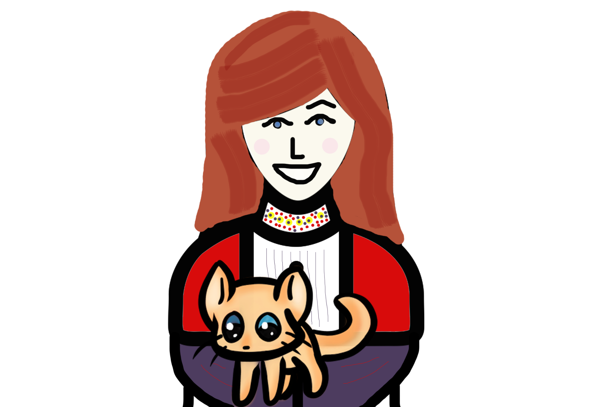

# Набор начинающего

_«Неважно чтобы я ни делала – он все-таки нашел меня. Теперь я знаю, как ему это удалось».
_

_«Да, это действительно открывает глаза»
_

_«Впервые кому-либо удалось пролить свет на данную проблему, обычно власти и понятия об этом не имеют»
_ 

## ДЛЯ КОГО ДАННЫЙ ГИД?
Всем и везде. Несмотря на то что что данный Гид был написан женщинами, сталкивающимися с домашним насилием или преследованием, данный Гид и изложенные принципы, могут быть использованы в независимости от пола, местонахождения или ситуации.

## ЧЕМ ДАННЫЙ ГИД?
Современные технологии, такие как Интернет/мобильные телефоны и т.д. позволяют злоумышленникам с легкостью преследовать, запугивать и угрожать своим жертвам онлайн и офлайн. Хорошая новость: теперь Вы можете принять меры по защите своей безопасности! Оцените свои риски и возьмите контроль в свои руки, используя эффективные меры, почерпнутые из данного Гида.

## КАК ИСПОЛЬЗОВАТЬ ДАННЫЙ ГИД?
Существует много способов отслеживания. Вероятность и легкость преследования будут напрямую зависеть от Ваших личных и обстоятельств Ваших злоумышленников. Данный Гид не предоставляет абсолютно исчерпывающих ответов. Данный Гид не включает всевозможные способы того, как злоумышленники могут преследовать кого-либо, но включает собрание советов и поддержку, отобранных специально для Вас. Вперед!