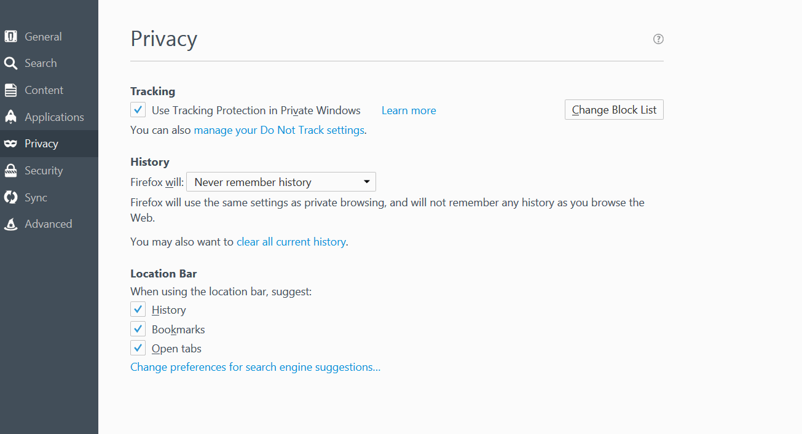

# Как защитить Ваш браузер?

### Chrome. Safari. Firefox. Explorer.

Во-первых, проверьте насколько надежен Ваш текущий браузер,использу [Panopticlick](https://panopticlick.eff.org)

Настройки Личных Данных - Не Отслеживать и Приватные Окна

## DO NOT TRACK НЕ ОТСЛЕЖИВАТЬ

**Chrome**&gt;Настройки-Показать Дополнительные Настройки--Личные Данные-Отправлять запрет отслеживания с исходящим трафиком

**Firefox** &gt; Опции &gt; Приватность &gt; управлять параметрами “Не отслеживать”

**Safari** &gt; Safari &gt;Меню &gt; Настройки &gt;Конфиденциальность&gt; Отслеживание на веб-сайтах &gt; Попросить веб-сайты не отслеживать мои действия

**Explorer** &gt; Explorer &gt; Инструменты \(Alt + X\) &gt;Безопасность &gt; Включить защиту от слежения &gt;Включить

![] (assets/explorer do not track.gif)

**Альтернативные браузеры и поисковые системы**

* [Brave](https://www.brave.com)- это браузер, который автоматически блокирует рекламу и отслеживающих
* [Tor](https://www.torproject.org/) - это программное обеспечение-браузер, которое позволяет бороздить Интернет анонимно
* [DuckDuckGo](https://duckduckgo.com/about) - это частная поисковая система, которая не отслеживает своих пользователей
* [StartPage](https://www.startpage.com/) - это частная поисковая система, которая не записывает Ваш IP  адрес или не отслеживает Ваши запросы
* track your searches

**Incognito Mode Режим Инкогнито**

* Режим Инкогнито предотвращает Google Chrome от сохранения 
* Историй Ваших посещений и загрузок.
* Настройте и управляйте Google Chrome &gt;Новое окно в режиме инкогнито
* Или нажмите: Ctrl + Shift + N

**Новое Приватное Окно \(Firefox\)**

* Новое Приватное Окно открывает новое  приватное окно в  Firefox.
* Открыть меню &gt; Новое Приватное Окно
* Или нажмите: Ctrl + Shift + P

**Новое Приватное Окно \(Safari\)**

* Новое Приватное Окно предотвращает Safari от сохранения отслеживания веб-страниц, которые Вы просматриваете.
* Меню файла&gt; Новое Приватное Окно
* Или нажмите: Command + Shift + N

**InPrivate**

* InPrivate помогает предотвратить Internet Explorer от хранения данных о сеансе просмотра.
* Инструменты &gt; Безопасность&gt; Просмотр InPrivate.
* Или нажмите:: Ctrl + Shift + P

### **Используйте VPN**

* VPN или Виртуальная Частная Сеть, это способ скрытия Вашего IP и шифрования всего Вашего интернет трафика, что никто не сможет узнать что Вы просматриваете онлайн.
* Бесплатный VPN: [OkayFreedom](http://www.okfreedom.com/en/) \(пожалуйста обратите внимание: бесплатная версия OkayFreedom поддерживает рекламу\), [TunnelBear](https://www.google.com/url?q=https://www.tunnelbear.com/).
   Вы можете найти бесплатный/условно-бесплатные VPN расширения Chrome VPN [здесь](https://chrome.google.com/webstore/search/VPN?_category=extensions), и бесплатные/условно-бесплатные дополнения Firefox VPN add-ons ниже меню Open menu &gt; Дополнения &gt; Получить дополнения &gt; наберите “VPN” в поле поиска.

## **Tor**

Браузер Tor Browser, созданный чтобы помочь Вам сохранять анонимность, это простой но в то же время эффективный способ  веб-сёрфинга без раскрытия Вашей личности кому-либо.

Загрузить можно [здесь](https://www.torproject.org/projects/torbrowser.html).

## Расширения браузера

Расширения браузера \(Дополнения/плагины\), это программы, которые расширяют или оборудуют браузер  по индивидуальным параметрам.  Расширения могут быть использованы для защиты Вашей приватности путем блокирования отслеживаний Вашей онлайн активности  третьими сторонами.   ПРЕДУПРЕЖДЕНИЕ: Расширения также могут быть злоумышленными \([примеры](http://www.makeuseof.com/tag/x-malicious-browser-extensions-help-hackers-target-victims)\)

### Рекомендуемые расширения:

* [HTTPS Everywhere](https://www.google.com/url?q=https://www.eff.org/https-everywhere&sa=D&ust=1478912695312000&usg=AFQjCNEBvYCAfkFF8TJ1eRyHbiH69J2OFw) \( Протокол Hypertext Transfer с Уровнем Защищённых Сокетов\)\)
* Защищает и шифрует Ваш интернет трафик
* [Privacy Badger](https://www.eff.org/privacybadger) блокирует отслеживающие [куки](https://en.wikipedia.org/wiki/HTTP_cookie)
* [uBlock Origin](https://www.ublock.org) это блокиратор  рекламы

# Удаление истории просмотров

* Chrome &gt; История &gt; Очистить историю
* Firefox &gt; Настройки&gt; Приватность&gt; История
* Рекомендуемые ПК Утилиты:

* [CCleaner](http://www.piriform.com/ccleaner)

* [BleachBit](http://www.bleachbit.org/)

---

