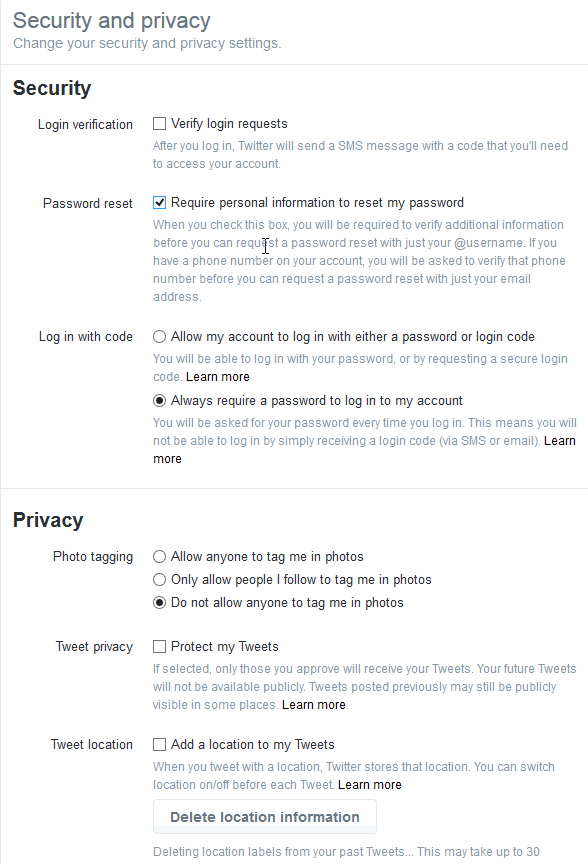

# Настройки Приватности в Социальных Сетях

## Facebook

### Кто может видеть мои материалы?

### Кто может связаться со мной?

### Как Мне Прекратить Назойливое Общение?

## Twitter

### Безопасность и конфиденциальность

## Устройства

### Деактивировать определение местоположения

| Насколько безопасен телефон Android | Насколько безопасен Ваш iPhone: |
| --- | --- |
|  | Отключить определение координат местоположения  по WiFi и  GPS геолокацию \(в разделе Местоположение\) и мобильные данные \(можно найти в разделе Настройки &gt;Персональные &gt;Местоположение\). Обратите внимание: Включайте параметры геолокации только в случае необходимости. Это уменьшит риск отслеживания вашего устройства, сократит передачу данных приложениями, работающими в фоновом режиме, и поможет сэкономить ресурс аккумулятора.\(Взято с: [https://securityinabox.org/en/guide/basic-setup/android](https://securityinabox.org/en/guide/basic-setup/android)\) |

Как Отключить Службы Местоположения в Настройках: [http://www.wikihow.com/Turn-Off-Location-Services-on-an-Android](http://www.wikihow.com/Turn-Off-Location-Services-on-an-Android) \| Отключить беспроводную и GPS геолокацию:  
Настройки &gt; Конфиденциальность &gt; Службы геолокации и отключить все Службы геолокации используя слайдер или используя индивидуальные слайдеры для каждого приложения, определяющего геолокацию. Для отключения Служб Геолокации для всех веб-сайтов, отключите Службы Геолокации для приложения Safari.  Как Отключить Службы Геолокации на iOS: [http://www.tomsguide.com/us/turn-off-location-services-iphone,news-21276.html\|](http://www.tomsguide.com/us/turn-off-location-services-iphone,news-21276.html|)

## Шифрование Ваших Устройств

**Android**

Настройки &gt; Безопасность&gt; Зашифровать устройство

Шифрование Вашего устройства занимает примерно один час, поэтому убедитесь что Ваша батарея заряжена. Вам нужно будет вводить пароль для расшифровки Вашего устройства каждый раз при включении.

**iPhone  
**

Все  iPhones зашифрованы по умолчанию.  Однако, Вам следует убедиться, что Вы используете длинный пароль для затруднения доступа к Вашему телефону.

## Приложения для переписок

### Whatsapp

Сообщения [WhatsApp](https://www.whatsapp.com/) зашифрованы \(то есть, содержание Ваших сообщений могут быть видны только Вам и Вашему получателю\), но метаданные о том, с кем Вы переписываетесь и длительность Вашей переписки, собираются и сохраняются.

### Signal

[Signal by Open Whisper Systems](https://whispersystems.org/) - это бесплатное приложение в открытом доступе для шифрования [голосовых звонков](https://en.wikipedia.org/wiki/Voice_calling) и [мгновенных сообщений](https://en.wikipedia.org/wiki/Instant_messaging) для Android,  iOS  и [Рабочего Стола](https://whispersystems.org/blog/signal-desktop/). Оно использует шифрование “от-конца-до-конца” для защиты общения с другими пользователями Signal. Signal может быть использован для отправления и получения зашифрованных мгновенных сообщений, групповых чатов, прикрепленных файлов и медиасообщений.

[Советы по безопасности, которые должен знать каждый пользователь](https://www.google.com/url?q=https://theintercept.com/2016/07/02/security-tips-every-signal-user-should-know/&sa=D&ust=1478912695344000&usg=AFQjCNEg5QaQwxEpg5CJqH049_FqKIAnYA)

# Дополнительные Советы

o  **Важно:** Пройдите Тест на Конфиденциальность от [Smart Privacy](https://www.google.com/url?q=http://smartprivacy.tumblr.com/privacynow&sa=D&ust=1478912695347000&usg=AFQjCNGjAN8OCYH3WXnd3DP_haNY--ZHog).

o Создайте  [Google Alert](https://www.google.com/url?q=https://www.google.com/alerts&sa=D&ust=1478912695348000&usg=AFQjCNH-T5bZUuRKQwCWL8x6g3JbYp3IkQ) на Ваше имя

---

