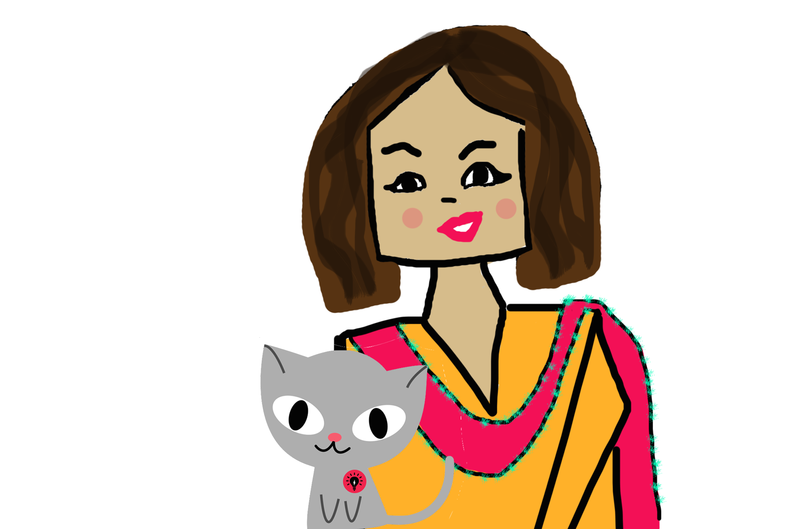

# اپنی اونلاین حفاظت خود کرنے کی تجاویز 

آپ اس رہنمایٔ کرنے والی دستاویز (گائڈ) کی  بنيادی قسم پڑھ رہے ہيں۔ ہمارے پاس ايک جديد قسم بھی ہے جو آپ يہاں جا کر پڑھ سکتے ہيں۔: https://chayn.gitbooks.io/advanced-diy-privacy-for-every-woman/content/

"میری ہر کوشش کے باوجود اس نے مجهے ڈهونڈ نکالا. اب مجهے سمجھ آیا کہ اس نے یہ کیسے کیا"

"واہ، واقعی اس کی وجہ سے میری آنکهوں سے پردے اٹھ گئے ہیں"

"یہ پہلی دفعہ ہوا  ہے کہ کسی نے اس موضوع پر روشنی ڈالنے کی کوشش کی ہے۔ ورنہ تو عام اربابِ اختیارات اس سے بالکل ناواقف ہوتے ہیں..."

## یہ  گائڈ کس کے لیے ہے؟
حالاںکہ یہ گائڈ ان خواتین کو ذہن میں رکھ کر لکھی  گیٔ ہے جو گهریلو تشدد کا نشانہ ہیں یا جن کا پیچها کیا جا رہا ہے،البتہ یہ گائڈ سب کے لیے ھے خواہ مرد ہو یا عورت،  دنیا کے کسی بھی حصے میں اور کسی بھی حالات میں کیوں نہ ہوں۔ 

کیا کسی کے پاس آپ کی تصویریں ھیں، اور آپ کو نھیں معلوم کے ان کے پاس کیسے آیں ؟
 
کیا وه مسلسل غیر متوقع طور پر ہر اس مقام پر پہنچ جاتے ہیں جہاں آپ ہوتے ہیں؟
 کیا وه آپ کی زندگی کے بارے میں ایسے راز جانتے ہیں جو آپ نے صرف چند لوگوں کو ظاہر کیے ہوں؟

 اگر آپ کا جواب 'ہاں' میں ہے ، تو سمجھ جائیں کہ آپ کا تعاقب کیا جا رہا ہے!!!

## اس گائڈ کا موضوع کیا ہے؟
جدید ٹیکنالوجی جیسے کہ موبائل فون، انٹرنیٹ، وغیره نے جارحانہ مزاج رکھنے والے افراد کے لیےاپنے شکار کو ہراساں کرنے اور ان  کا پیچھا کرنے میں آسانیاں پیدا کر دیں ہیں،  چاہے وه انٹرنیٹ  ہو یا حقیقی زندگی۔ 
آپ کے لیے اچھی خبر یہ ہے کہ اب آپ اپنے بچاؤ کے لیے مؤثر اقدامات کر سکتے ہیں۔ یہ گائڈ آپ کو خطرات کو سمجھنے اور ان سے نمٹنے میں رہنمأی فراہم کرتی ہے۔ 

## اس گائڈ کا استعمال کیسےکیا جا سکتا ہے؟
آپ کا تعاقب بہت سارے طریقوں سے کیا جا سکتا ہے. لیکن اس کے کتنے  امکانات ہیں اور یہ کام کتنی آسانی سے ہو سکتا ہے۔۔۔ اس کا دارومدارآپ کے اور آپ کا پیچھا کرنے والے کے ذاتی حالات پر بہت ذیادہ منحصر ہے۔
یاد رہے! یہ گائڈ آپ کے تمام سوالوں کا جواب شاید نہ دے سکے، لیکن اس میں موجود تجاویز اور معلومات آپ کو بنیادی طور پر اپنی حفاظت کے لیے اقدامات لینے میں معاون ثابت ہو سکتیں ہیں۔

---

اگرٰ آپ پاکستان مین رہتی ہین تو آپ ھمارا انٹرنٹ کی مفت حلپلاین سے رابتا کر سکتے ھین:  0800-39393 on Monday to Friday from 9:00 a.m. to 5:00 p.m. helpdesk@digitalrightsfoundation.pk

