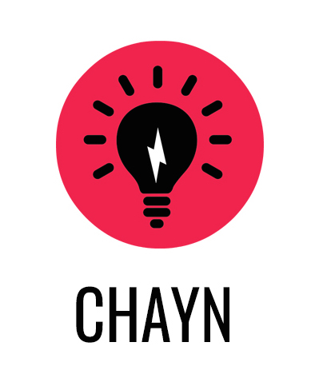

# عمدہ پاسورڈ لگانے کا طریقہ
سب سے عام غیر محفوزی پر قابو پانے کے لیے آسان اقدام

### ۱۔ پاس ورڈ کی حفاظت
* ’میرا پاس ورڈ کتنا محفوز ہے؟‘‘ پر جائیے اور اپنے پاس ورڈز کی صلاحیت کا امتحان لی جیے :https://howsecureismypassword.net

* کبھی بھی اپنے پاس ورڈز کو دوبارہ استعمال نہیں کریں

* مختلف ویب سائٹز پر ایک ہی پاس ورڈ نہیں استعمال کرین ـ ہرویب سائٹ کے لیے ایک نیا پاس ورڈ بنائیں

* اپنے براؤزر کو اپنا پاس ورڈ محفوز (سیو) نہیں کرنے دیں

* پاس ورڈ میں الفاظ کی جگہ جملہ ڈالنے کا سوچیں

* بڑے اور چھوٹے حروف، عدد (نمبرز) اور علامتوں کا استعمال کریں۔ توانا پاس ورڈ جنریٹر (اسٹرونگ  پاس ورڈ جنریٹر) دیکھیے: https://strongpasswordgenerator.com
  پاس ورڈ مینیجرز میں بالعموم بنیادی طور پر پاس ورڈ تخلیق کرنے کا جنریٹر ہوتا ہے جو پیچیدہ پاس ورڈ بناتا ہے۔

### ۔ پاس ورڈ مینیجرکا استعمال کریں

پاس ورڈ منتظم (مینیجمنٹ) کرنے والا سافٹ وئیرآپ کے پاس ورڈ کی خوفیہ شکل زخیرہ کرتا ہے۔ اس طرح آپ ایک انوکھا اورمحفوظ پاس ورڈ استعمال کر سکتے ہیں ہر الگ سروس کے لیے بغیر انہیں یاد رکھے۔ بہت سارے [مفت پاس ورڈ مینیجرزمیں](http://thehackernews.com/2016/07/best-password-manager.html) سے آپ چن سکتے ہیں جیسے کہ [کی پاس KeePass](http://keepass.info/) (دیکھیں اس کو کس طرح نصب کرتے ہیں اور استعمال بھی:https://www.youtube.com/watch?v=GyuVLIbmI5U ، لاسٹ پاس: https://lastpass.com/how-it-works/ اور پیڈ لاک: https://padlock.io/

### ۳۔ آپ کو پاس ورڈ کیسے بدلنا چاہیے

اس بات پرکافی بہس ہو چکی ہے کہ آپ کو اپنا پاس ورڈ کتنے وقفے کہ بعد بدلنا چاہیے۔ اب تجویز کی گئی ہے کہ ہر ۳ سے ۹ مہینوں کے بیچ پاس ورڈ بدل لینا چاہیے۔ ہم یہ بھی مشورہ دیتے ہیں کہ اپنے آپ کو محفوز قرار کرنے کے لیے باربار بھی پاس ورڈ بدل لیں۔

### ۴۔ ٹو فیکٹر اوتھینٹیکیشن \(2FA\)

ٹو فیکٹر اوتھینٹیکیشن آپ کے اکاؤنٹ میں گھسنے والے کی کوشش کو مشکل کر دیتا ہے۔ نہ صرف آپ اپنے اکاؤنٹ کو کھولنے کے لیے ایک کام کرتے ہیں، یعنی کہ پاس ورڈ ڈالنا، بلکہ آپ ایک دوسرے قسم کا ڈیٹا بھی ڈالتے ہیں، جو ایک چھوٹا سا خوفیہ پیغام ہوتا ہے جو آپ کو ای میل، پیغام رسانی (ٹیکسٹ میسج)، یا آپ کے فون پر ایک ایپ کے ذریعے ملتا ہے۔ دیکھیے کونسی سائٹز آپ کو ٹو فیکٹر اوتھینٹیکیشن استعمال کرنے کے قابل کرتی ہے: 

http://twofactorauth.org/

---

