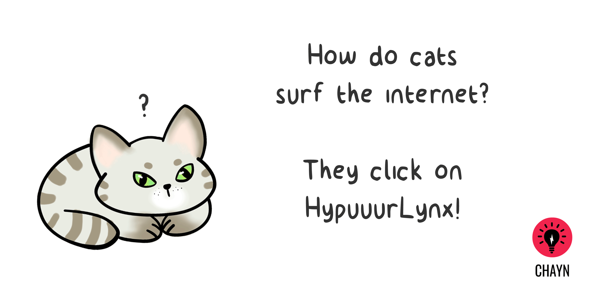
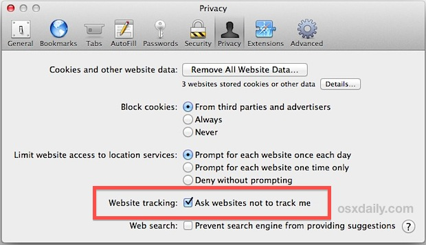
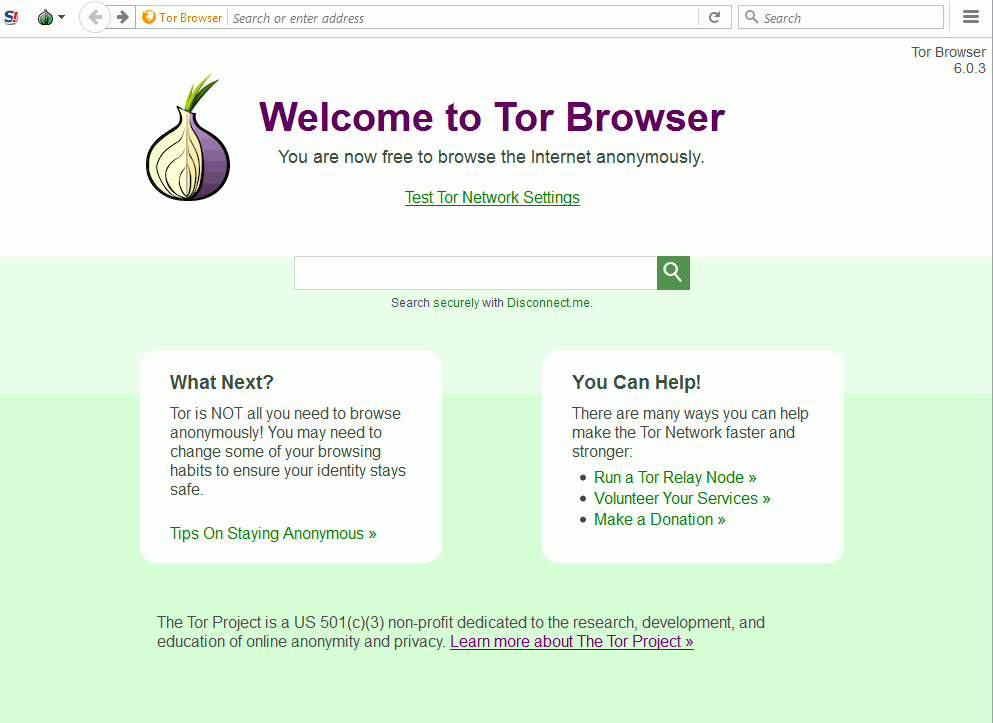

# اپنے براؤزر کو کیسے محفوظ کرتے ہیں

### گوگل کروم۔ سفاری۔ فائر فاکس۔ ایکسپلورر Chrome. Safari. Firefox. Explorer.

پہلے پین اوپٹی کلک کے ذریعے اپنے موجودہ براؤزر کی حفاظت کی آزمائش کرین:: https://panopticlick.eff.org 

اور یے بھی کرنا نا بھولیے گا:

براؤزر کی رازداری کی ترتیبات (پرائیویسی سیٹنگ) ـ تعاقب نہیں کریں (ڈو ناٹ ٹریک) اور خصوصی براؤزنگ ونڈوز (پرائیویٹ براؤزنگ ونڈوز)

## ڈو ناٹ ٹریک DO NOT TRACK
### گوگل کروم

**Chrome** &gt; Settings &gt; Show Advanced Settings &gt; &gt; Privacy &gt; Send “Do Not Track” request with your browser traffic

### فائر فاکس

**Firefox** &gt; Options &gt; Privacy &gt; manage your Do Not Track settings

### سفاری
**Safari** &gt; Menu &gt; Preferences &gt; Privacy &gt; Website tracking &gt; Ask websites not to track me

### ایکسپلورر
**Explorer** &gt; Tools \(Alt + X\) &gt; Safety &gt; Turn on tracking protection &gt; Enable

**متبادل براؤزرز اور سرچ انجنز**

* [بریو](/www.brave.com) ایسا براؤزر ہے جوخود بخود اشتہار اور تعاقب آلہ کو روکتا ہے

* [ٹور](https://www.torproject.org) ایسا براؤزنگ سافٹ وئیر ہے جو آپ کو نامعلوم طریقہ سے ویب سائٹ  دیکھنے کے قابل کرتا ہے

* [ڈک ڈک گو](https://duckduckgo.com/about) ایک خصوصی تلاشی انجن (سرچ انجن) ہے جو اپنے استعمال کرنے والون کا تعاقب نہیں کرتا

* [اسٹارٹ پیج](https://www.startpage.com) ایک خصوصی تلاشی انجن (سرچ انجن) آپ کے آئی پی ایڈرس کو زخیرہ نہیں کرتا اور آپ کی تلاش کی ہوئ چیزوں کا تعاقب نہیں کرتا۔

**بہروپی انداز(انکاگنیٹو موڈ)**

* انکاگنیٹوموڈ ویب پرگوگل کروم کو آپ کی ڈاؤن لوڈ کی ہوئ چیزوں کو اور دیکھی ہوئ سائٹز کو زخیرہ کرنے سے روکتا ہے۔
* دبا کر رکھیں  Ctrl + Shift + N

**نئ خصوصی ونڈو(فائر فاکس) **

* نئ خصوصی ونڈو(نیو پرائیویٹ ونڈو) ایک خصوصی ونڈو کھولتا ہے فائر فاکس میں۔
* دبا کر رکھیں  Ctrl + Shift + P

**نئ خصوصی ونڈو :سفاری)**

* نئ خصوصی ونڈو سفاری کو آپ کے دیکھے ہوےٴ ویب پیجزکو ذخیرہ کرنے سے روکتا ہے
* دبا کر رکھیں  Command + Shift + N

**ان پرائیویٹ**

* ان پرائیویٹ انٹرنیٹ ایکسپلورر کو آپ کی دیکھی ہوےٴ ویب سائٹز کا ڈیٹا زخیرہ کرنے سے روکتا ہے
* دبا کر رکھیں Ctrl + Shift + P

### وی پی این استعمال کریں
* وی پی این آپ کے آئ پی ایڈرس کا روپ بدلنے کا اور آپ کی انٹرنیٹ کی عاملیت (ٹریفک) کو خفیہ بنانے کا طریقہ ہے۔ اس طرح کسی کو پتہ نہیں چلیگا کہ آپ آن لائن کیا دیکھ رہے ہیں۔ 
* مفت وی پی این: او کے فریڈم:http://www.okfreedom.com/en/ (دہان رکھیں کہ او کے فریڈم کی مفت قسم اشتھار کی حمایت کرتی ہے)۔ ٹنل بئیر:https://www.tunnelbear.com مفت یا مفت پریمیم گوگل کروم پے وی پی این کے اضافات: مفت یا مفت پریمیم فائر فاکس پے وی پی این کے اضافات:

## ٹور  براؤزر

ٹار براؤزر ایسا براؤزر ہے جو آپ کو نامعلوم قائم رکھنے کے لیے بنایا گیا ہے۔ یہ ایک آسان اور موثر طریقہ ہے اپنی شناخت ظاہر کرے بغیر براؤزنگ کرنے کا۔ ادھر سے ڈاؤن لوڈ کرین: https://www.torproject.org/projects/torbrowser.html

 ## براؤزر Extensions  کے اضافات

براؤزر کے اضافات (ایکسٹینشن یا پلگ انز) ایسے پروگرام ہیں جو آپ کے ویب براؤزر میں اضافہ کرنے کی یا اپنی مرزی کے مطابق تبدیلی لانے کے قابل کرتی ہے۔ یہ اضافات کسی تیسری پارٹی کو آپ کہ آن لائن عاملیت کی تعاقیب کرنے سے روکتا ہے، اگرچہ یہ آپ کی رازداری کو محفوز رکھتا ہے۔ خبردارـ ایکسٹینشنز بد نیّتی سے بھی استعمال کی جا سکتی ہیں:
 http://www.makeuseof.com/tag/x-malicious-browser-extensions-help-hackers-target-victims/

### تجویزشدہ ایکسٹینشن

* ایچ ٹی پی پی ایس اوری وئیر آپ کی انٹرنیٹ کی عاملیت (ٹریفک) کو محفوز رکھتا ہے:
[HTTPS Everywhere](https://www.google.com/url?q=https://www.eff.org/https-everywhere) 
* پرائیویسی بیڈجر کوکیز کو روکتا ہے
* [Privacy Badger](https://www.google.com/url?q=https://www.eff.org/privacybadger&sa=D&ust=1478912695313000&usg=AFQjCNHNcMDqQbrzK_GX-cQYVUy8pTlayw) blocks tracking [cookies](https://www.google.com/url?q=https://en.wikipedia.org/wiki/HTTP_cookie&sa=D&ust=1478912695313000&usg=AFQjCNH4OGzxCGUGlINzUNYhUFSYSylzLA)
* یوبلاک اوریجن اشتہار کو روکتا یے:
[uBlock Origin](https://www.google.com/url?q=https://www.ublock.org/&sa=D&ust=1478912695314000&usg=AFQjCNGJa0xJXHwX03kI2KCd3aZ1nc58KA) is an adblocker

# براؤزر کی سرگزشت (براؤزنگ ہسٹری) کو مٹانا
* Chrome &gt; History &gt; Clear browsing data
* Firefox &gt; Options &gt; Privacy &gt; History
* تجویزشدہ پی سی کلینرز:

* [CCleaner](https://www.google.com/url?q=http://www.piriform.com/ccleaner&sa=D&ust=1478912695317000&usg=AFQjCNHmtswm2AwMsRtywjxd7unIPKSXSg)

* [BleachBit](https://www.google.com/url?q=http://www.bleachbit.org/&sa=D&ust=1478912695318000&usg=AFQjCNEjz3m2EuO6O2lPl4Vo_KAe6CHsjQ)

---
گرٰ آپ پاکستان مین رہتی ہین تو آپ ھمارا انٹرنٹ کی مفت حلپلاین سے رابتا کر سکتے ھین: 0800-39393 on Monday to Friday from 9:00 a.m. to 5:00 p.m. helpdesk@digitalrightsfoundation.pk

